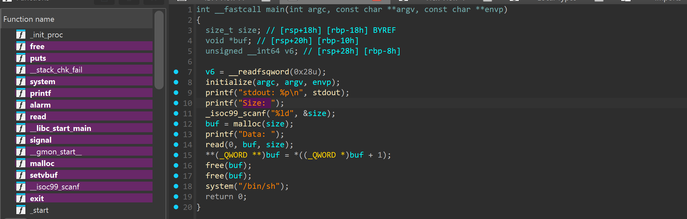
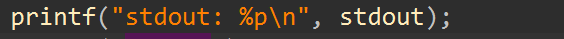
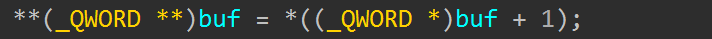
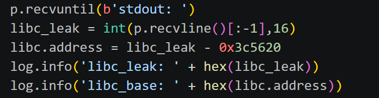
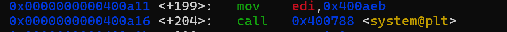
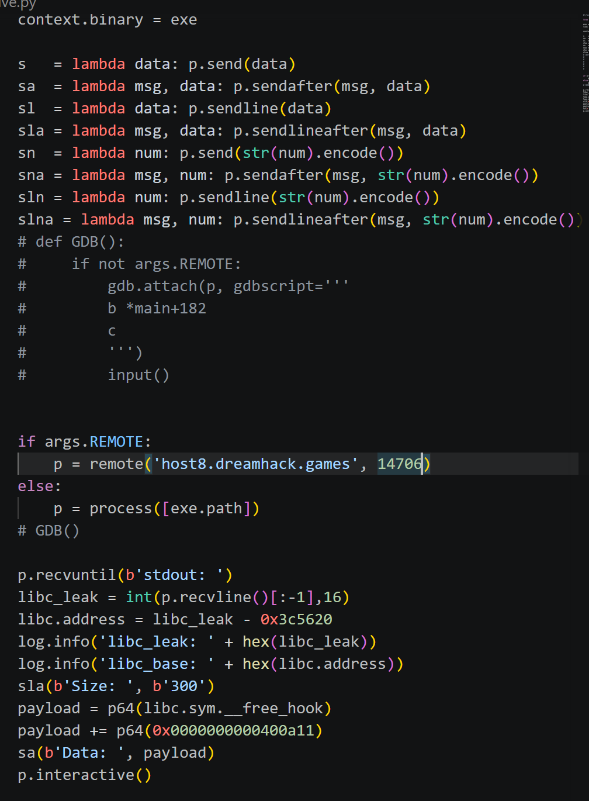
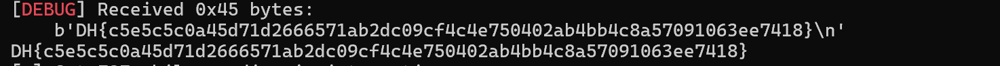

# 1. Find Bug:

- 2 free(buf) -> ko thể chạy tới system("/bin/sh")

- Thấy free(buf) -> Khả năng overwrite hook

# 2. Idea :

- Leak stdout -> libc leak -> libc base

- Thấy dòng này nghĩa là **buf = *(buf+1) và buf sau cách buf trước 8byte do QWORD -> Nhập vào read 8byte của __free_hook và 8byte của system

# 3. Exploit :

- Đầu tiên ta sẽ tìm libc base

- Giờ chỉ cần overwrite __free_hook = system("/bin/sh") nhưng ko thể set tham số /bin/sh nên ta sẽ nhảy tới chỗ set /bin/sh để nó chạy tiếp đến system, chứ ko nhảy thẳng đến system

### SCRIPT :

# 4. Get Flag :

