# 1. Find Bug :

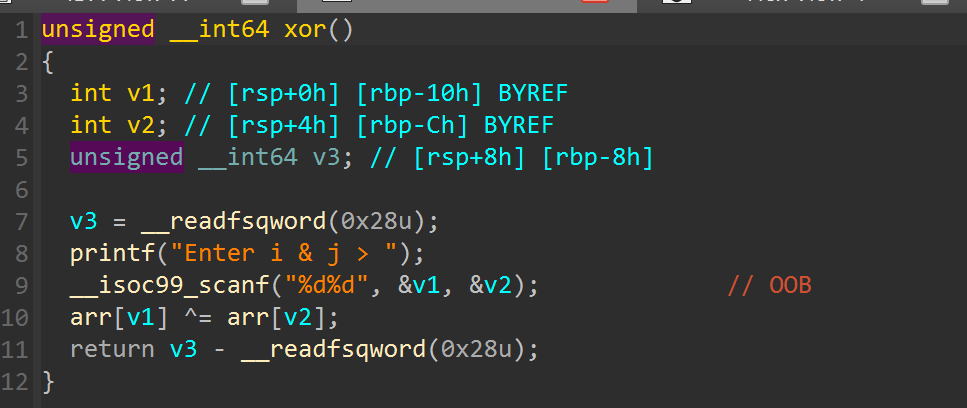

- i, j là các index của mảng như kiểu dữ liệu `int` -> OOB

# 2. Idea :

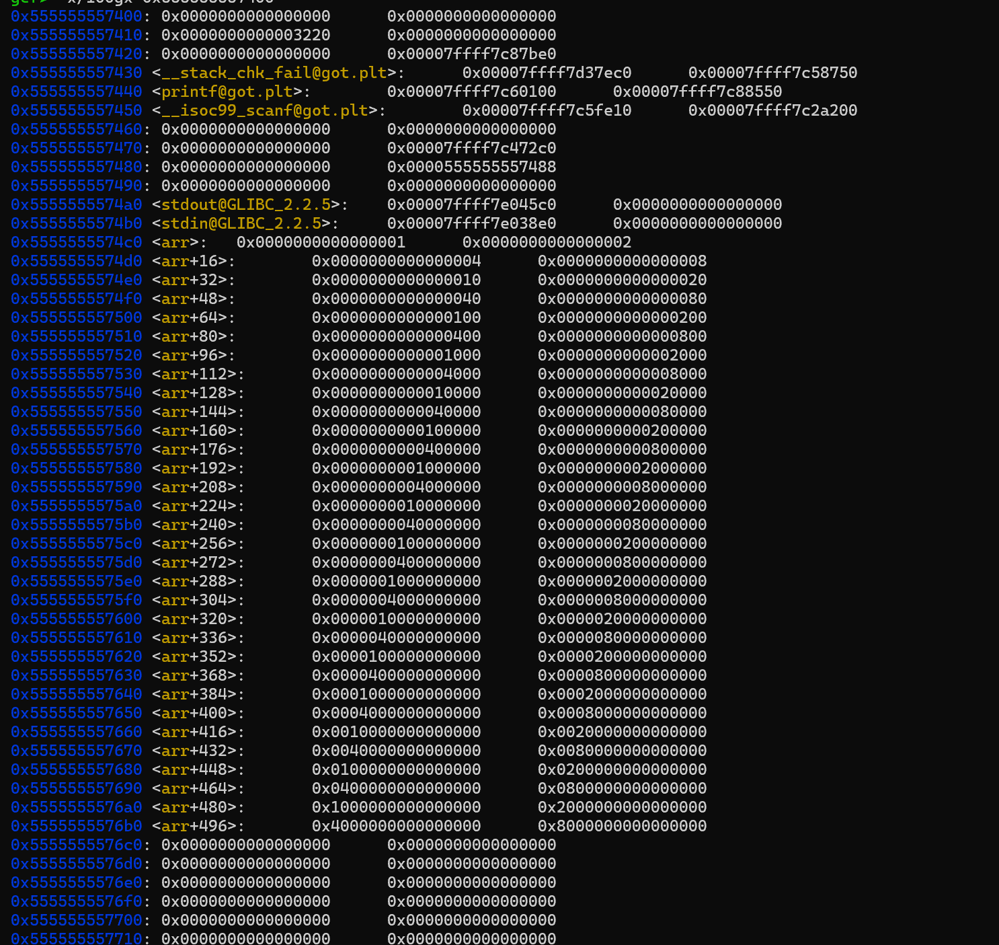

---------------------------------
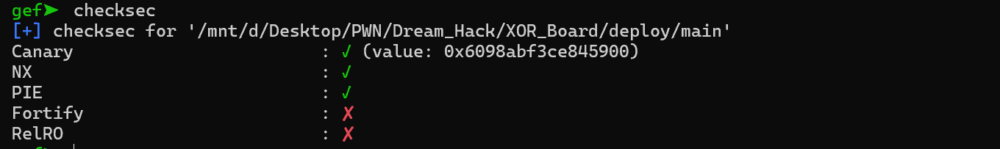

- Xem index quanh `arr` thấy có các GOT đồng thời Relro tắt + tận dụng `xor` -> Overwrite GOT

# 3. Exploit :

- Lựa chọn `GOT scanf`, có 2 hướng
  + Hướng 1 : XOR `GOT scanf` với chính nó cho về 0 -> xor tiếp với `win`. Nhưng cách này ko được vì khi XOR `GOT scanf` về 0 thì ngay sau đó lại gọi `scanf` trước khi nó chạy hàm `win` -> fail 
  + Hướng 2 : XOR `GOT scanf` với 1 số trung gian ( tạm gọi là mask ) -> `win` ( Dùng được )

- STAGE 1 : LEAK binary base -> win ( do PIE bật )

  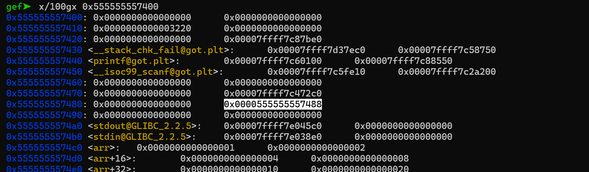

  
  + Tại index = -7 ta tìm được 1 địa chỉ binary nhưng do hàm `print` ko in được tại index âm -> Ta cần xor 1 index dương nào đó hiện tại giá trị bằng 0 ( chọn 100 ) với index -7 rồi in ra

  + Sau khi có binary leak -> binary base -> `win`

  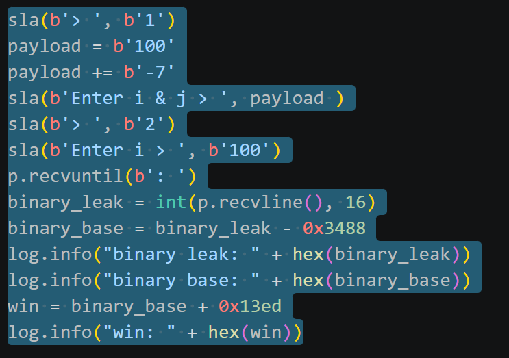

  ---------------------------------------
  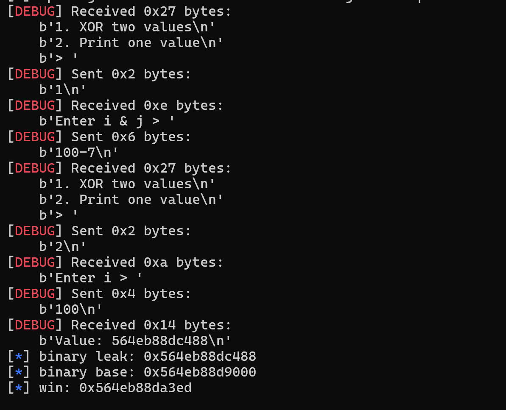

- STAGE 2 : LEAK GOT scanf 
  
  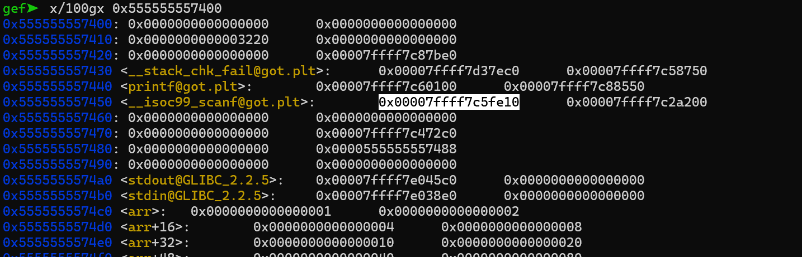

  + `GOT scanf` cũng ở index âm -> leak tương tự STAGE 1

  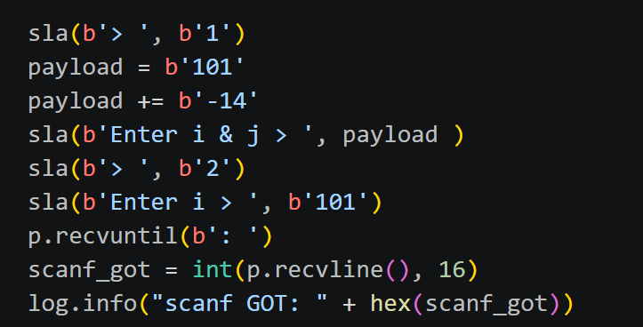

  -------------------------------------------
  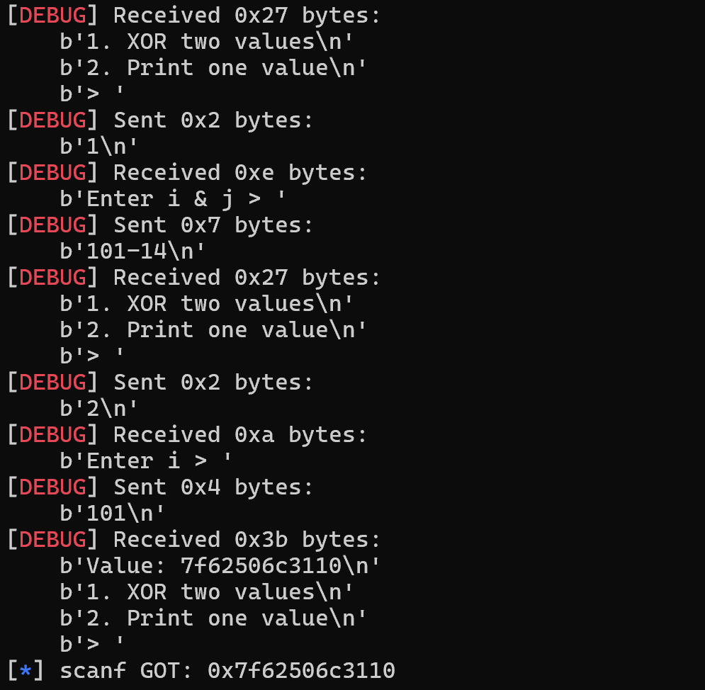

- STAGE 3 : Tìm mask 
  + Ta có `GOT scanf` XOR `mask` = `win` -> `mask` = `GOT scanf` XOR `win` ( Tính chất của `XOR` )

  + Tạo mask ở index trung gian khác ( chọn 102 ) để khi xong chỉ cần XOR `GOT scanf` một lần là get shell ( tránh XOR `GOT scanf` nhiều lần bị lỗi)

  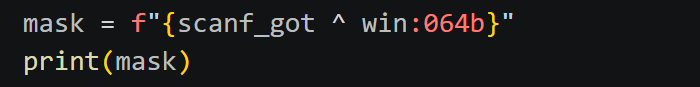

  ----------------------
  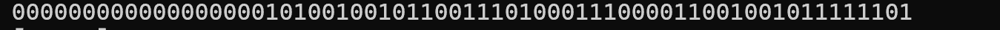

  + Chuyển mask -> số nhị phân 

  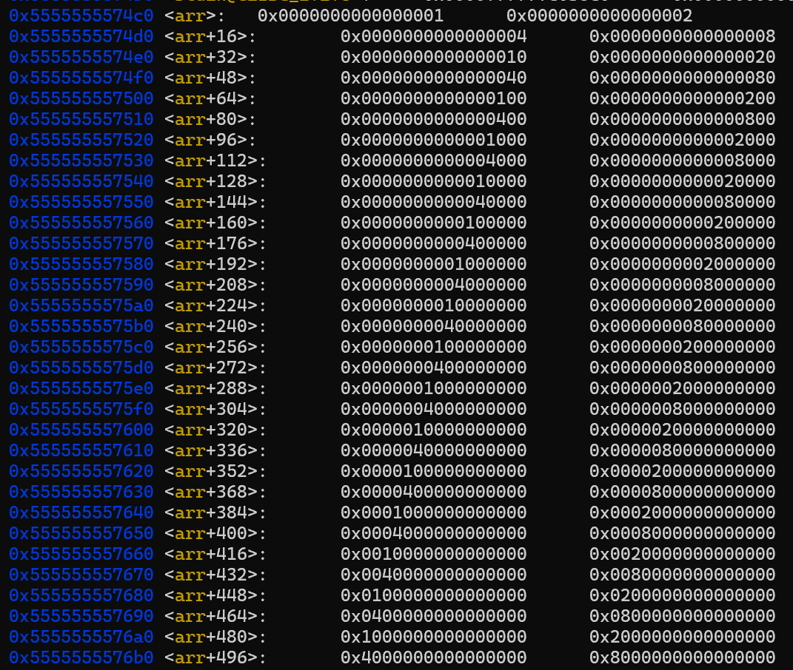

  + Và điều đặc biệt ở `arr` đó là giá trị(nhị phân) tại các index 0,1,3,4 ,... lần lượt là 0..1, 0..10, 0..100, 0..1000 -> Tận dụng điều đó ta sẽ tạo được mask

  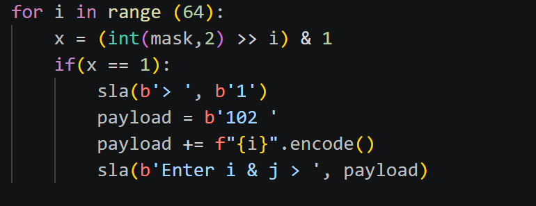

  + Với 64bit nên ta sẽ quét các bit của `mask` 63 lần với index i từ 0 -> 63

  + Và sau mỗi `i` vòng lặp ta sẽ dịch phải mask `i` bit và `&1` để xét bit cuối cùng ( Xét lần lượt từng bit của mask ) 

  + Nếu bit của `mask` là 1 thì sẽ XOR index trung gian với đúng index `i`

- STAGE 4 : `GOT scanf` XOR `mask`

    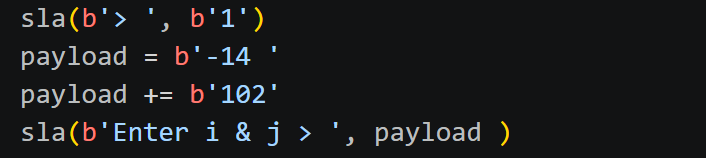

# 4. Get Flag :

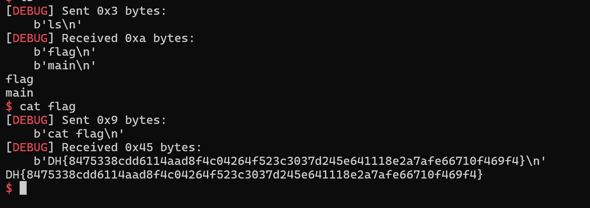

