# 1. Find Bug :

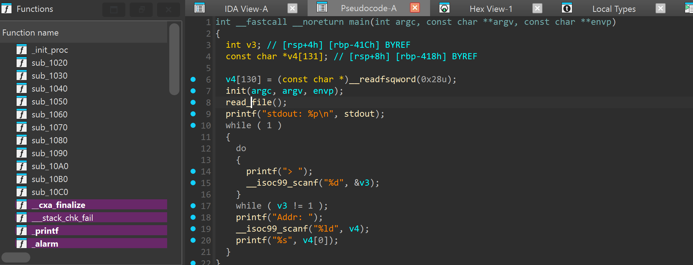

- `stdout` -> leak libc

- `printf` cuối -> in ra nội dung mà v4 trỏ tới

# 2. Idea :

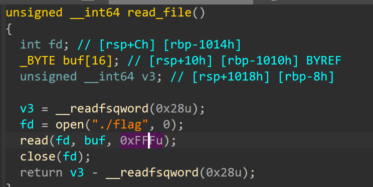

------------

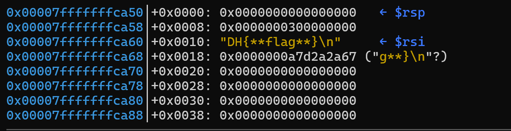

- Debug ta thấy open mở rồi lưu `flag` được lưu vào `buf` tại address `0x00007fffffffca60` <stack>

- Vì v4 in ra nội dung mà địa chỉ trỏ tới nên để lấy flag -> v4 = `buf` address <stack> <- Cần stack_leak <- `environ` <- libc_base

- Vòng lặp `while(1)` -> Có thể leak và gửi nhiều lần

# 3. Exploit : 

- Từ stdout -> libc_leak :

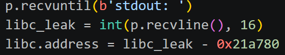

- Offset libc_leak và libc_base :

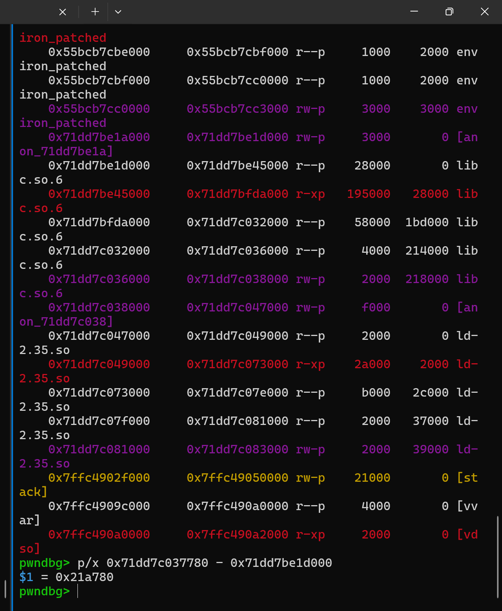

- Tìm offset giữa libc_base và `environ` :

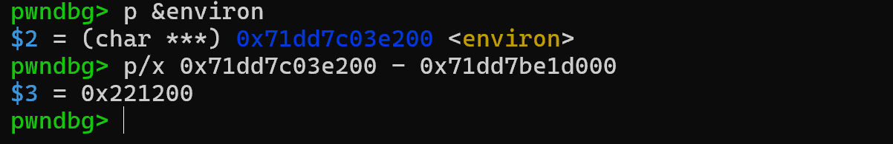

- Sau khi có `environ` ta leak `stack address`

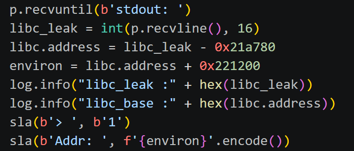

-----------------------------------------------------------------

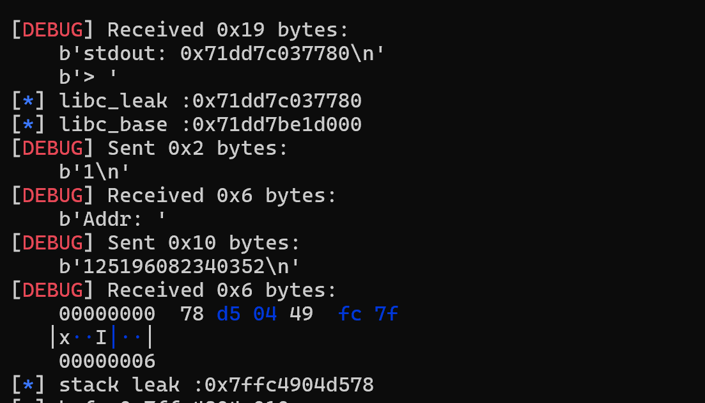

- Tìm offset giữa stack_leak và buf_address

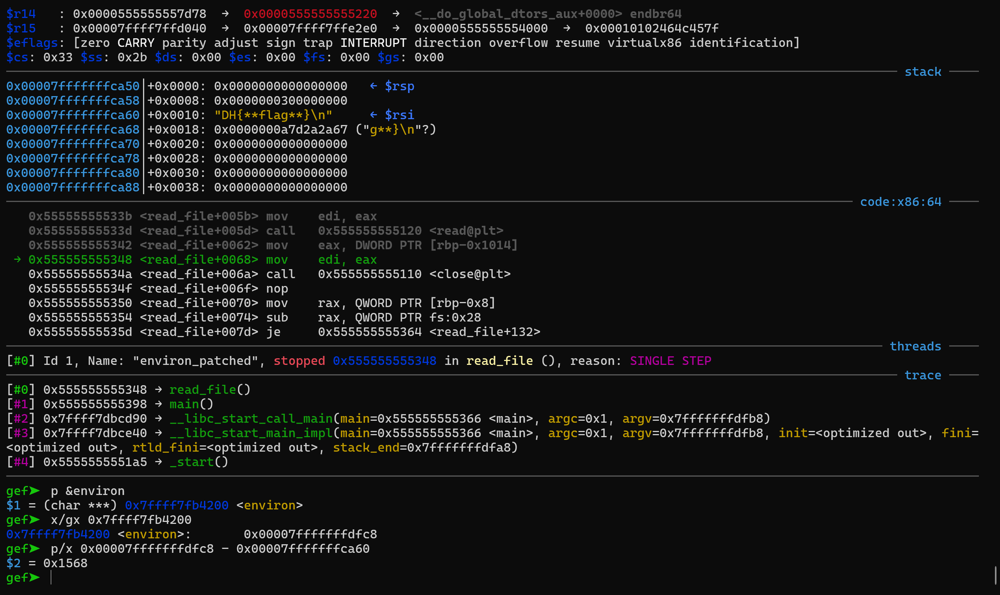

- Có buf _address rồi thì gửi và get flag

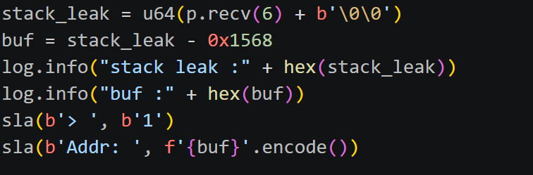

## SCRIPT :

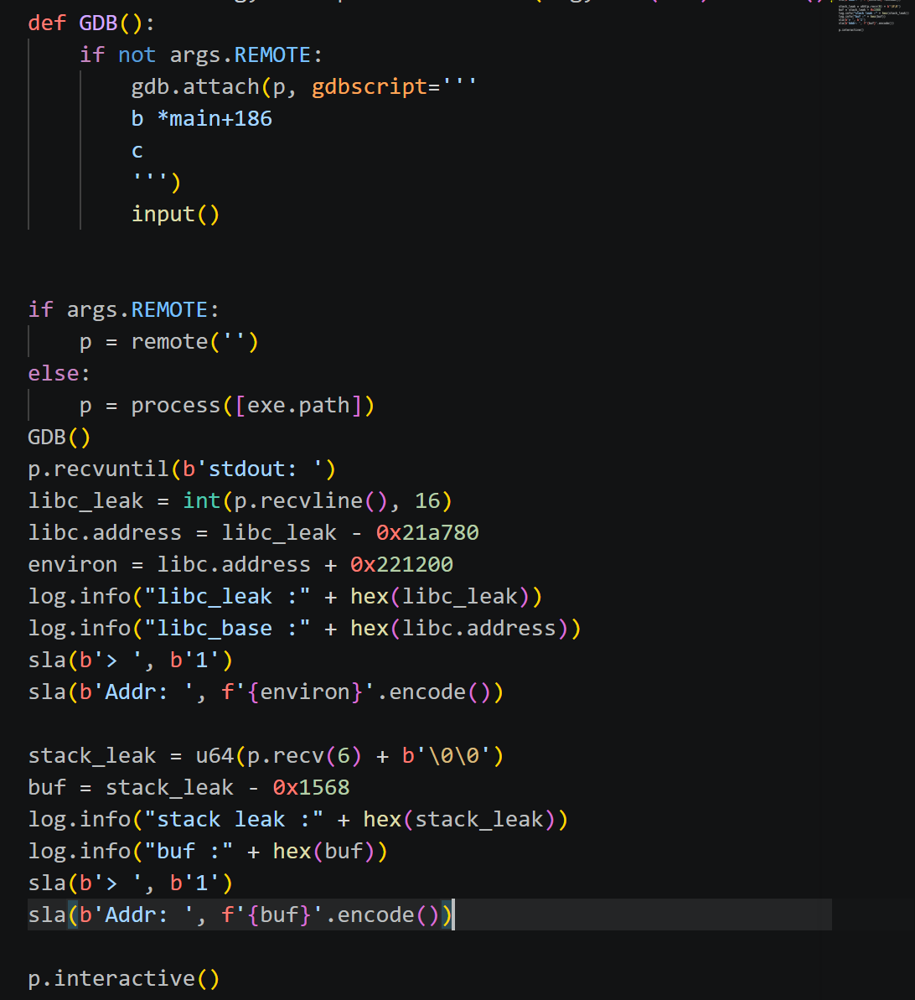

# 4. Get Flag :

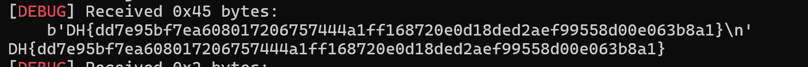

# 5. Learned :

- `environ` : địa chỉ thuộc `libc` trỏ tới `stack address`
