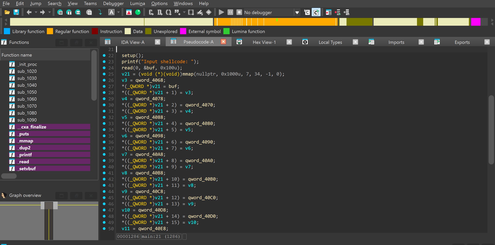
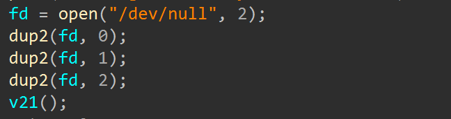
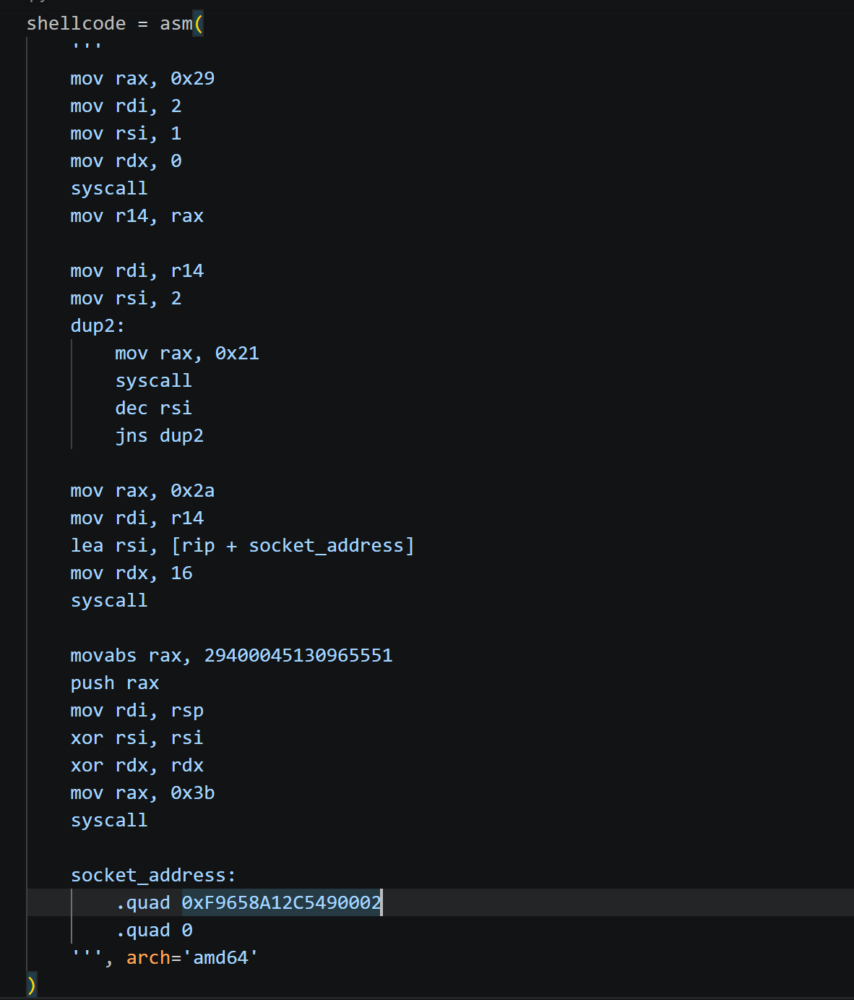
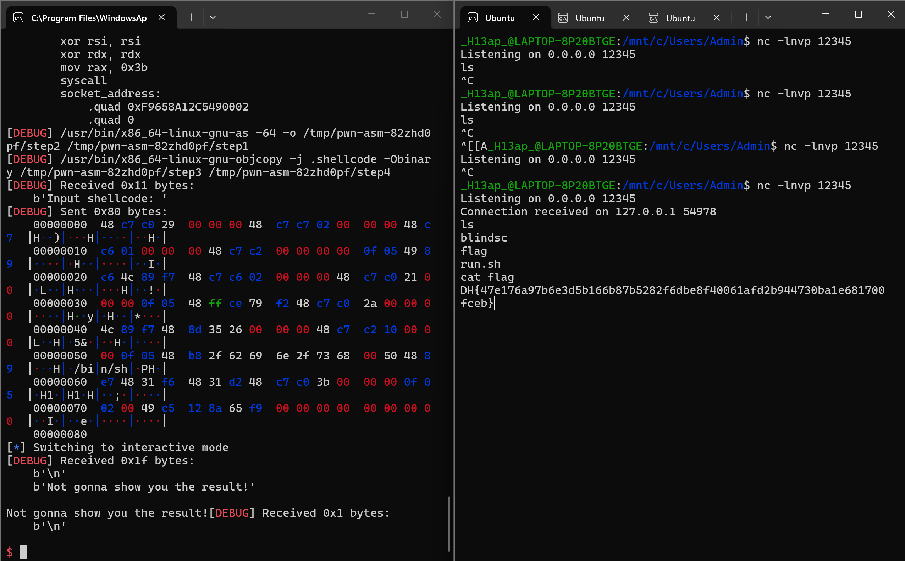

# 1. Find Bug :

- Nhập shellcode vào vùng được `mmap`

# 2. Idea :

- Vì `dup2` điều hướng shell vào `/dev/null` -> Reverse shell

# 3. Exploit :

## SCRIPT :

- Reverse shell : 
  + Với local : Ta kết nối với `localhost`, port 12345 rồi dùng `dup2` + `socket` + `connect` để điều hướng stdin(0), stdout(1), stderr(2) để terminal đang listen port có thể nhập input, output
thì lúc này `socket_address` sẽ là `.quad 0x100007F39300002` ( IP + port + IPv4 )
  + Với sever : Vẫn mở terminal nghe ở port 12345 nhưng `socket_address` sẽ là `.quad 0xF9658A12C5490002`, đây là IP + port của `ngrok`(kết nối thẳng sever đến localhost)

# 4. Get Flag : 

# 5. Learned :

- Reverse shell : Giúp điều hướng stdin, stdout, stderr về terminal của mình
