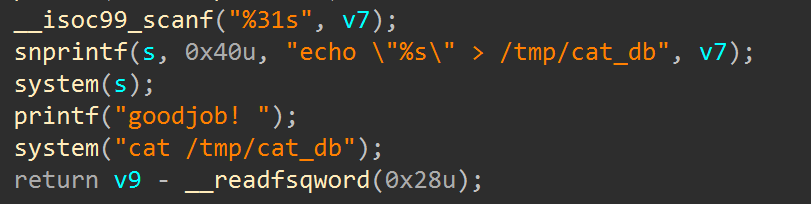
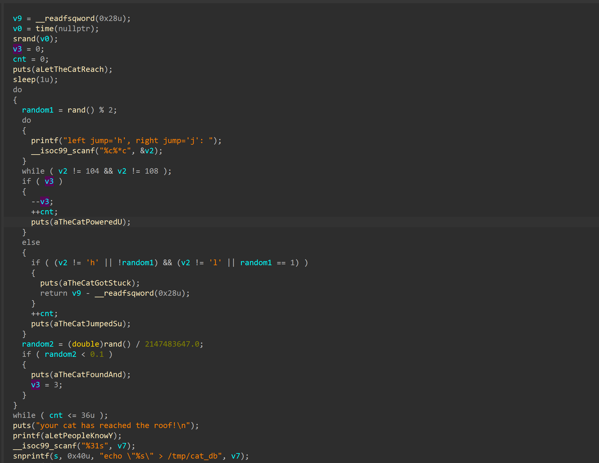
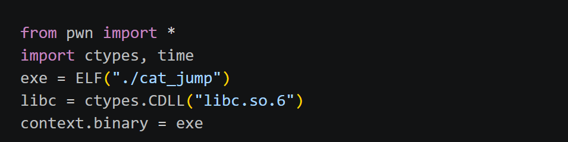
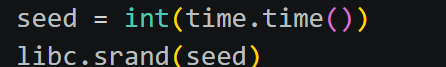
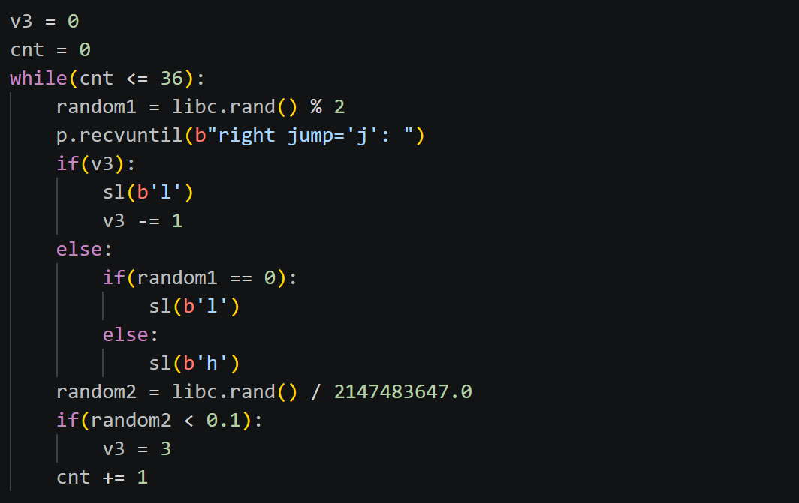
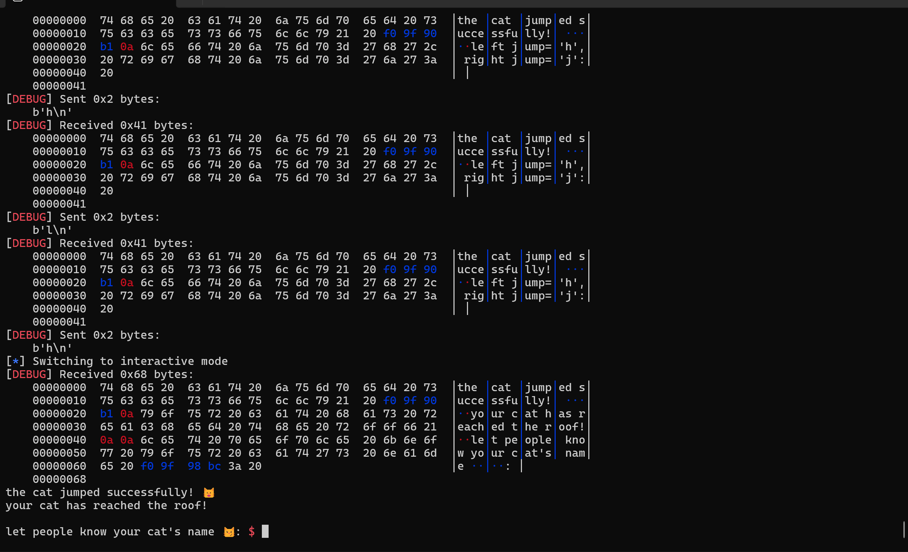
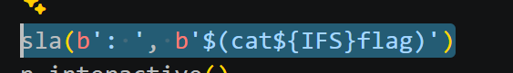
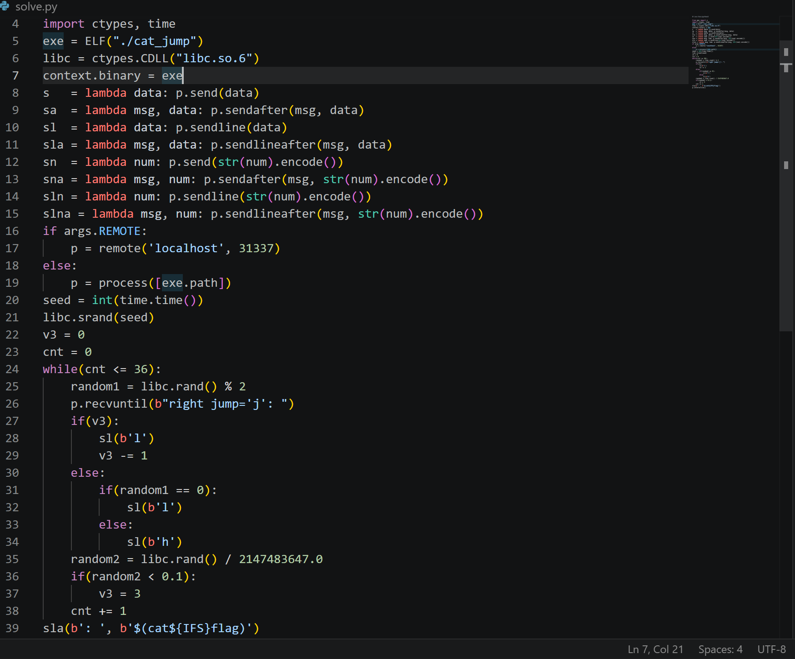
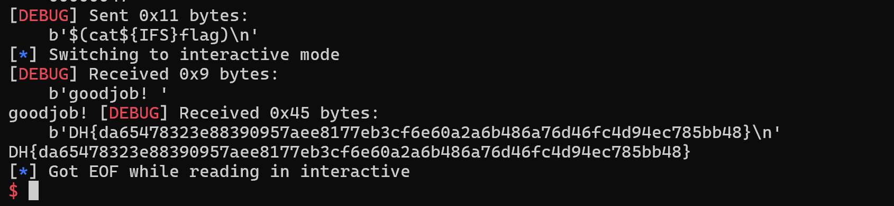

# 1. Find bug :

- `system(s)` -> Command injection

# 2. Idea :

- Logic chương trình : Để chèn Command injection <- Phải win game ( Thắng >36 lần) <- Nếu random1 == 0 phải chọn `l`, nếu random1 == 1 phải chọn `h` nếu ko sẽ thua game

-> Phải predict `rand()`

# 3. Exploit :

- Từ dockerfile -> leak libc 

- Khai báo, load thư viện của C (vì hàm rand của C khác python)

- Cơ chế hoạt động của hàm `rand()`: Để `rand()` random <- `srand()` phải random <- Cần `seed` 

- Tạo seed giống chương trình từ time (số giây tính từ 1970 đến hiện tại)

- Khởi chạy srand() với seed

---------------

- Viết script logic giống chương trình, để nó tự dự đoán `rand()` và tự gửi payload để win game

- Sau khi win game -> Chèn command injection nhưng LƯU Ý : Do `snprintf(s, 0x40u, "echo \"%s\" > /tmp/cat_db", v7);` nên khi gửi lệnh vào nó sẽ hiểu đấy là văn bản thuần túy chứ ko phải lệnh vì vậy phải dùng `$(...)` để thực hiện lệnh trong ngoặc 

- Thêm `${IFS}` thay dấu khoảng trắng do `scanf`

## SCRIPT :

# 4. Get Flag :

# 5. Learned :

- Từ dockerfile -> có thể leak libc

- Cách predict rand()

- Một số mẹo với command injection
