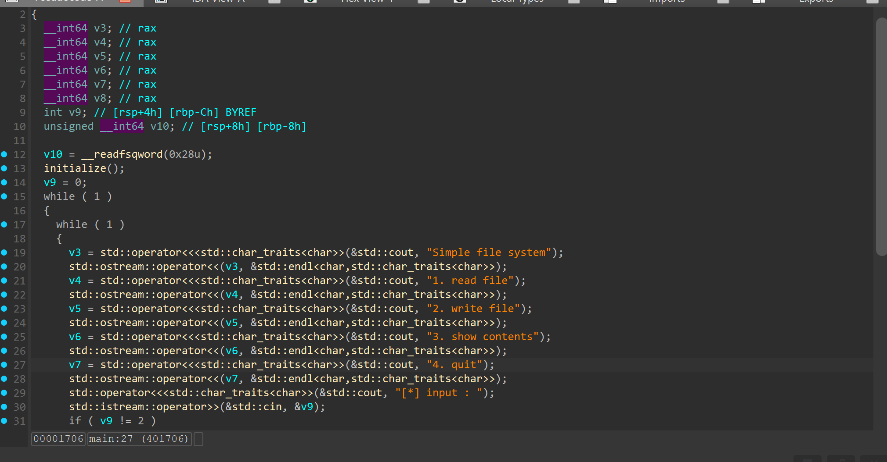
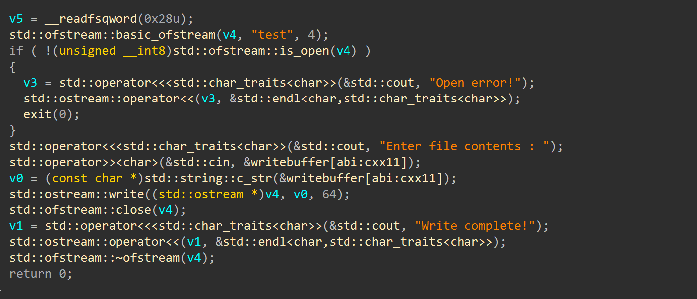
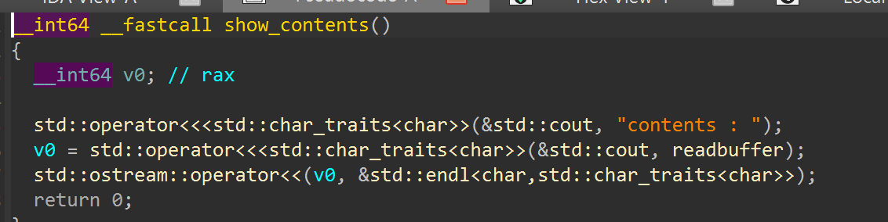
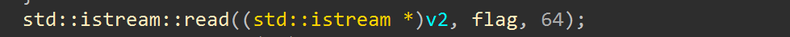
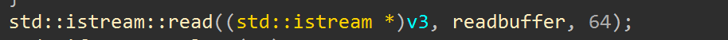
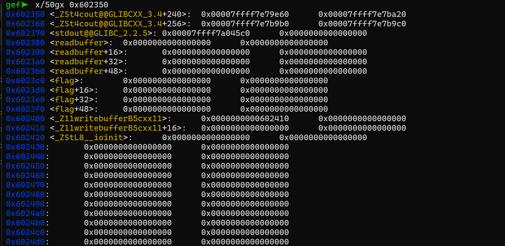
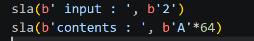
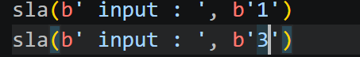
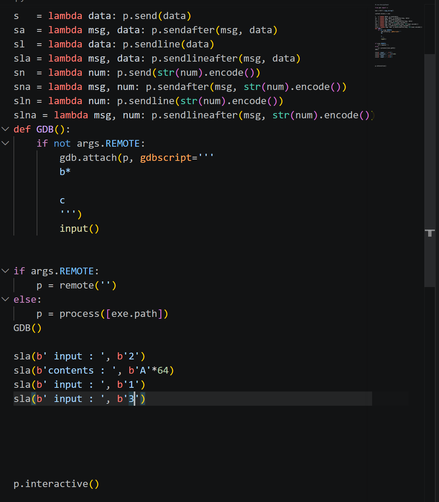
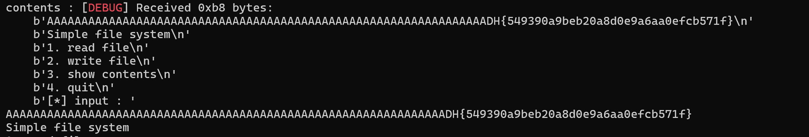

# 1. Find Bug :

- Tổng quan là sẽ có 4 option -> đi sâu vào từng option

- Với hàm `write_file` thì nhập vào `write_buffer` và mở file `test` lấy dữ liệu từ `write_buffer` -> buffer overflow

- Với `show_contents` thì in ra màn hình, lấy dữ liệu từ `read_buffer`

- Với hàm `flag` thì ghi nội dung flag vào `flag`

- `read file` đọc nội dung file `test` vào `readbuffer`

# 2. Idea :

- Chọn option 2 `write_file` nhập tràn -> ghi vào file `text` số lượng tối đa là 64byte

- Chọn option 1 gồm cả `read_flag` và `read file` -> `read file` sẽ ghi 64byte nội dung từ file `text` vào `readbuffer` -> sẽ nối chuỗi với `flag` luôn do ko có byte NULL

- Chọn option 3 `show_contents` in ra màn hình nội dung của `readbuffer` -> in ra flag

# 3. Exploit :

- Vậy khi nhập `write_file` ta nhập >= 64 cũng được vì khi ghi vào file text cũng chỉ tối đa 64byte và từ 64byte ấy sẽ được `readbuffer` nối chuỗi với flag

- Sau đó chọn option 1 để `read_file` ghi nội dung file text vào `readbuffer` để nối với flag rồi chọn option3 `show_contents` là in ra flag

### SCRIPT :

# 4. Get Flag :

