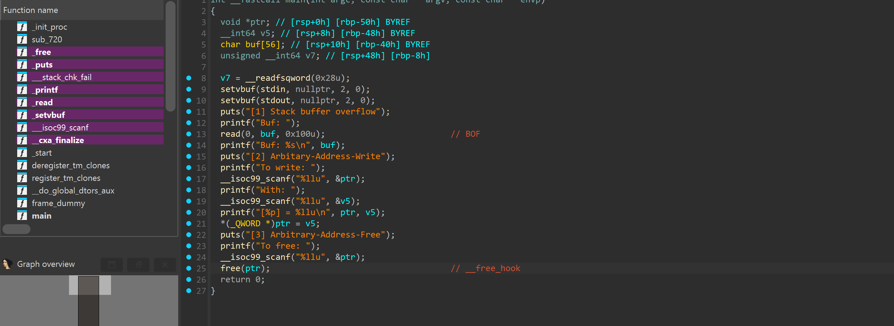
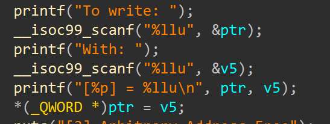
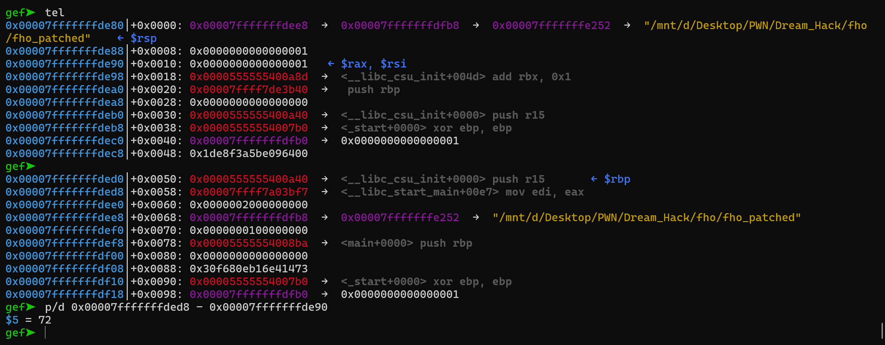
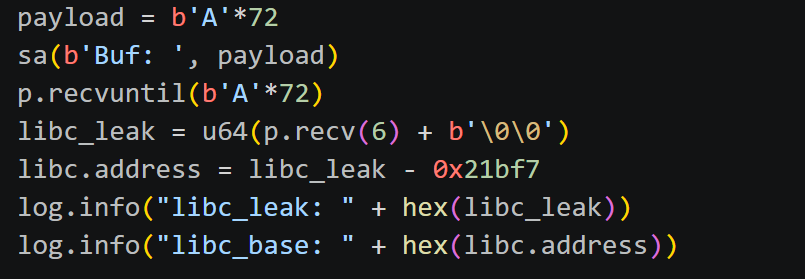
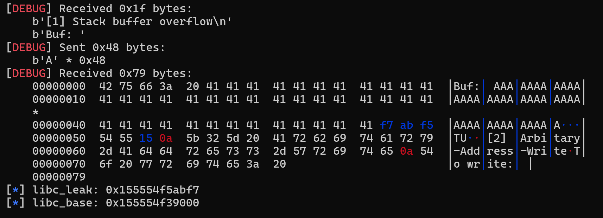
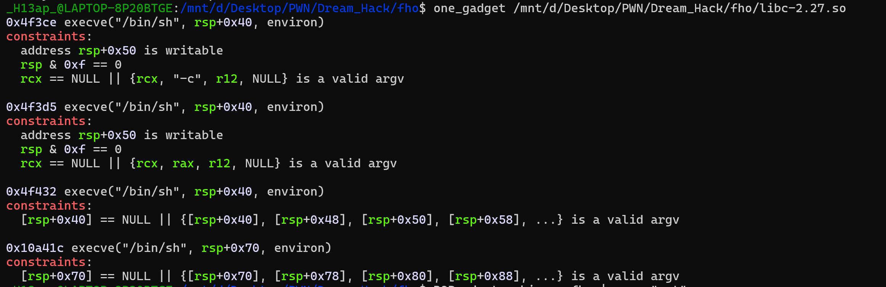
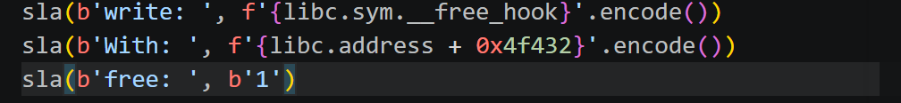
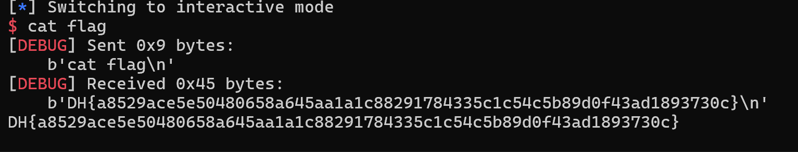

# 1. Find Bug :

- BOF ở hàm `read`

- `free(ptr)` -> tận dụng __free_hook

# 2. Idea :

- `*ptr = v5` và được nhập cả 2 -> Overwrite `__free_hook` thành `target address`

# 3. Exploit :

- STAGE 1 : LEAK LIBC

  

  + Leak `libc start main` với padding đã tính toán là `72` nhờ BOF và hàm `printf("Buf: %s\n", buf)`

  

  ---------------------------------
  

  + Sau khi có libc_leak -> libc_base

- STAGE 2 : Overwrite GOT

  + Với việc có libc_base -> Dùng `one_gadget`

  

  + `target address` = `libc_base` + `offset` ( Thử lần lượt các offset ở one_gadget)

  

# 4. Get Flag :

