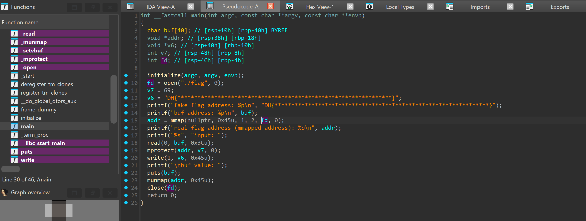
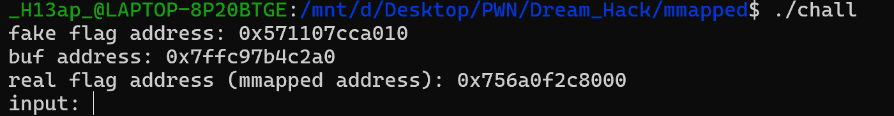
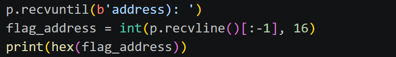
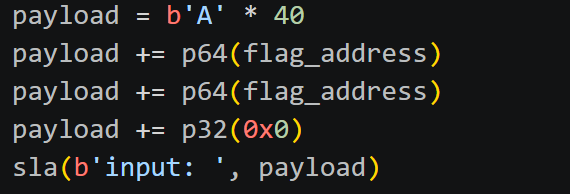
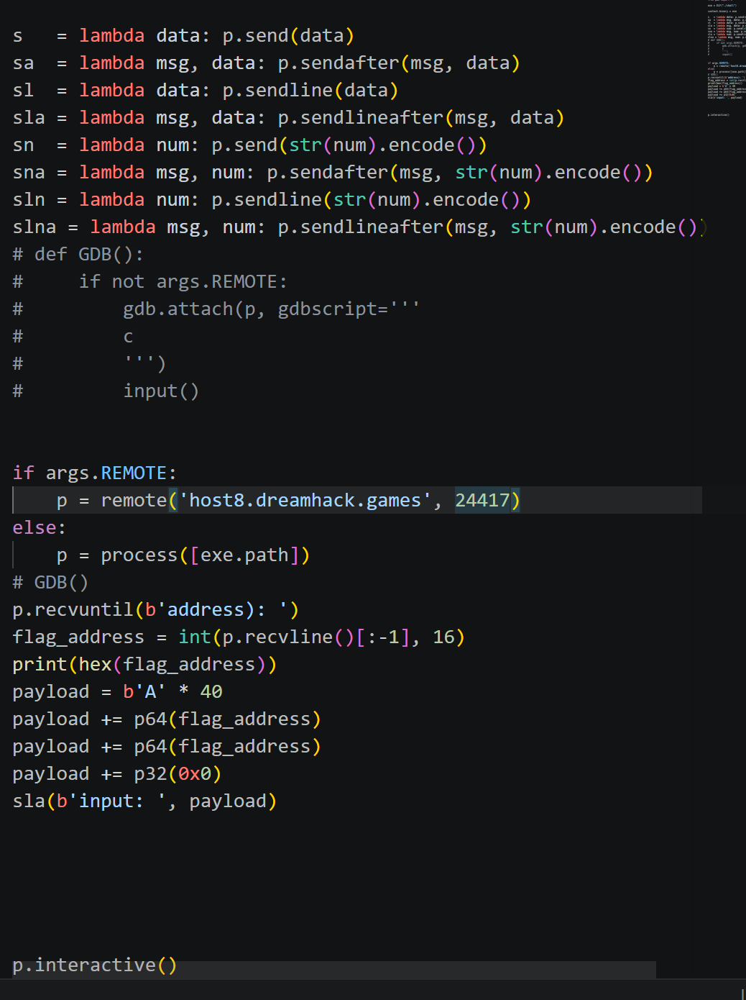
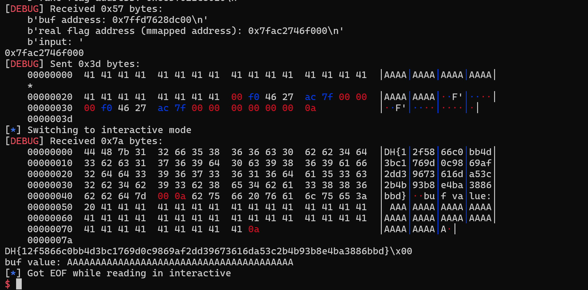

# 1. Find Bug :

- Buffer Overflow ở hàm read

# 2. Idea :

- Chương trình leak real flag address -> overwrite v6(fake flag address) thành real flag address

- Sau khi nhập input sẽ hàm write sẽ in ra màn hình nội dung tại v6 -> in ra flag thật

# 3. Exploit :

- Nhận real flag address

- Overwrite v6 ( fake flag address ) -> real flag address, đồng thời set size mprotect = 0 để ko làm ảnh hưởng flag

### SCRIPT : 

# 4. Get Flag :

