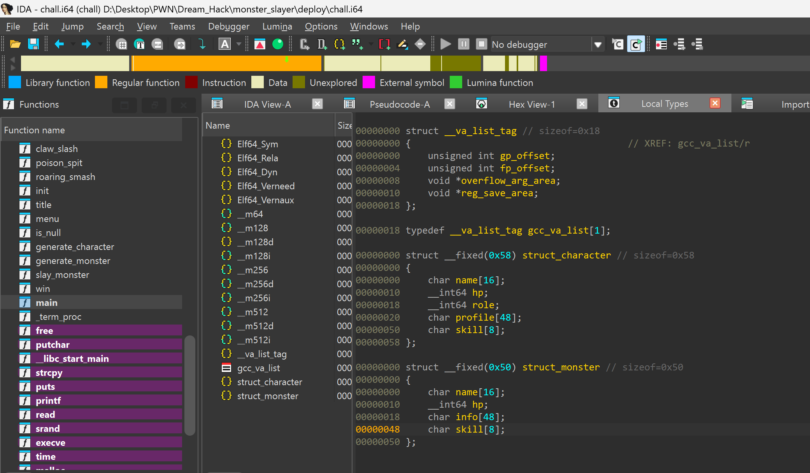
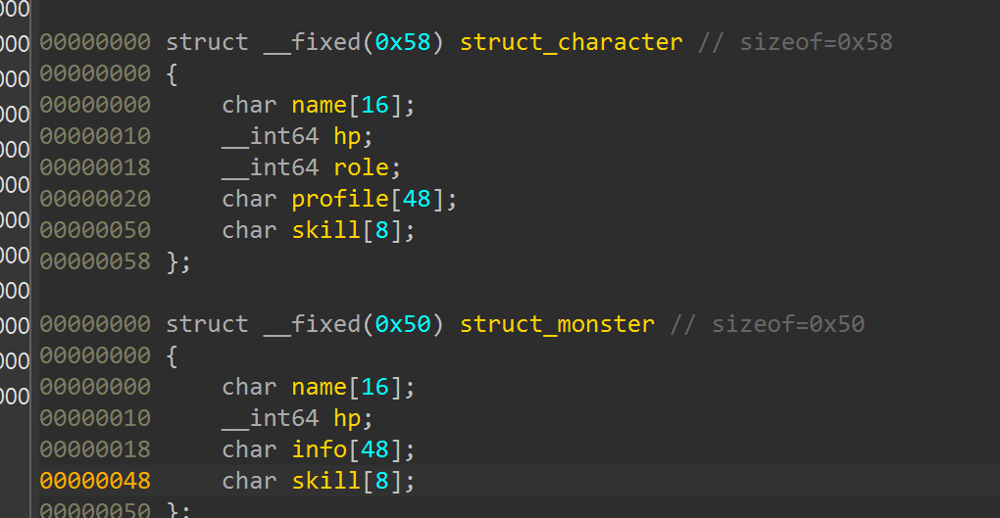
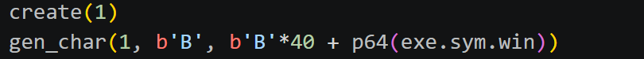
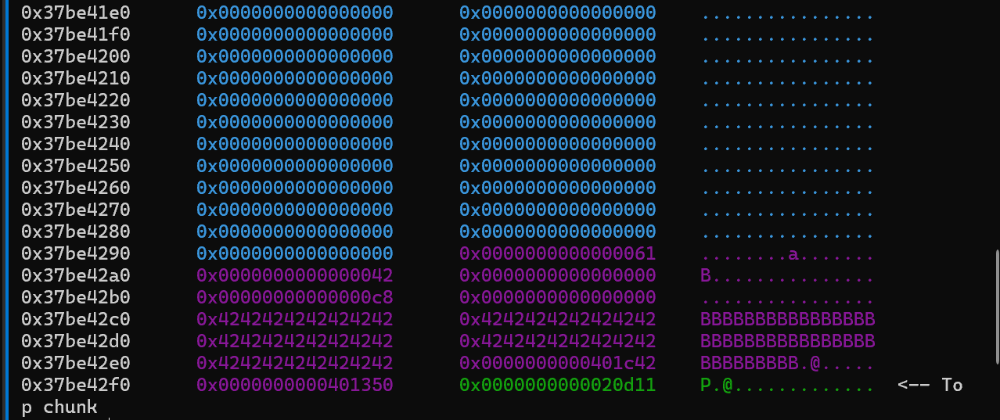
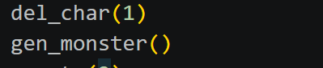
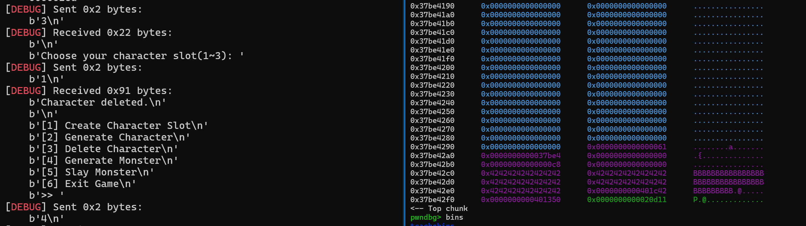
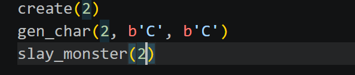
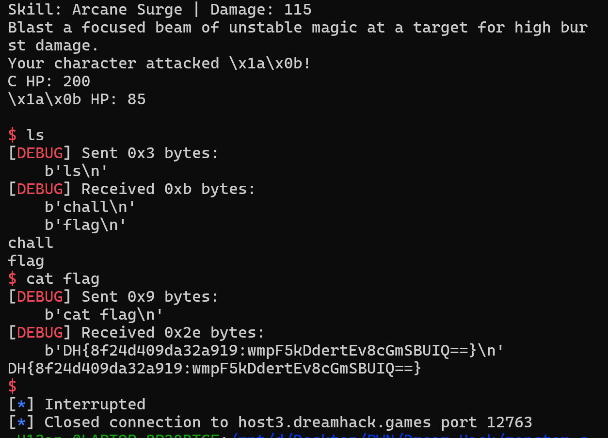

# 1. Find Bug :

- Nhìn `struct` character & monster ta thấy `monster skill` cùng offset với 8 byte cuối của `profile character` mà `profile character` có thể viết vào, `monster skill` thì sẽ kích hoạt ở hàm `slay monster`

# 2. Idea :

- Vì `character` và `monster` cùng thuộc `1 tcachebin` -> content `monster` = content `character`

- Căn chỉnh sao cho `profile character` chứa hàm win -> khi sang monster thuộc `skill monster`

# 3. Exploit : 

- Ta thấy `skill monster` bắt đầu ở `0x48` & `profile character` bắt đầu ở `0x20` -> cần padding 40byte + `win address`

---------------------

- Tạo slot, tạo character

-------------------------

- Xóa `character` vừa rồi và tạo `monster`

- Dữ liệu `character` được bê nguyên sang `monster` vì bypass được `is_null`, `is_null` kiểm tra nếu con trỏ NULL sẽ tạo một bộ info mới cho `monster`. Nhưng do cơ chế `safe linking` từ libc 2.32 mặc dù chunk của `character` trỏ NULL nhưng `forward pointer` fd bị mã hóa nên luôn ko phải NULL -> bypass tự nhiên

- Cuối cùng là tạo `character` mới và `slay monster` -> get shell

# 4. Get Flag :

# 5. Learned :

- Từ libc 2.32 cơ chế `Safe _ Linking` làm chunk luôn ko trỏ NULL vì đã mã hóa `forward pointer` 
