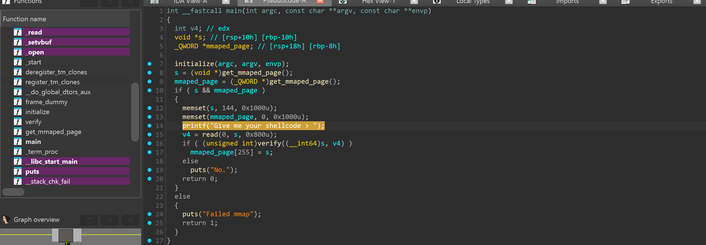
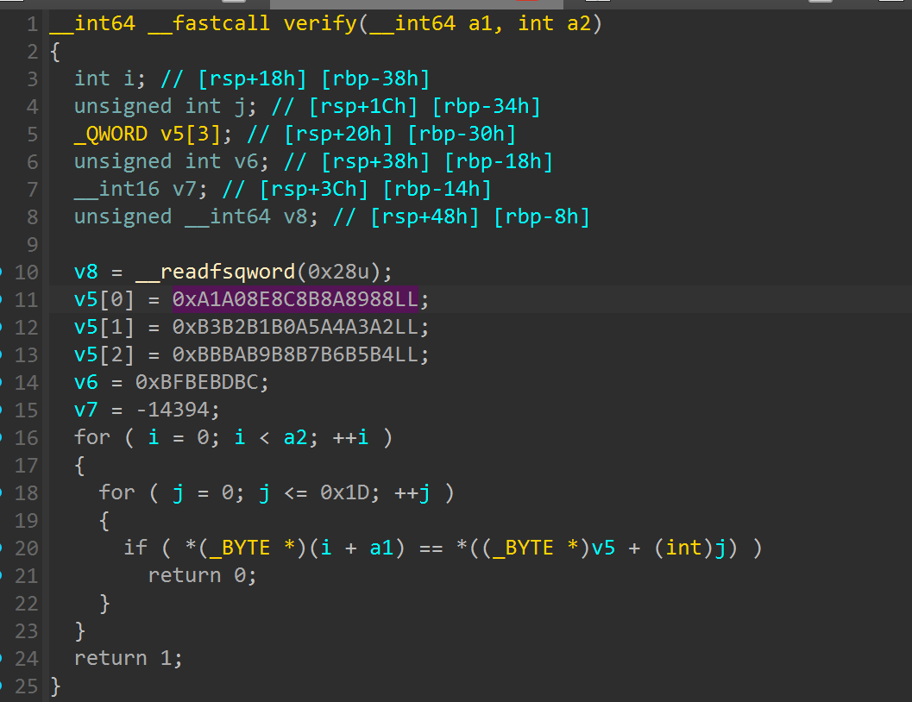
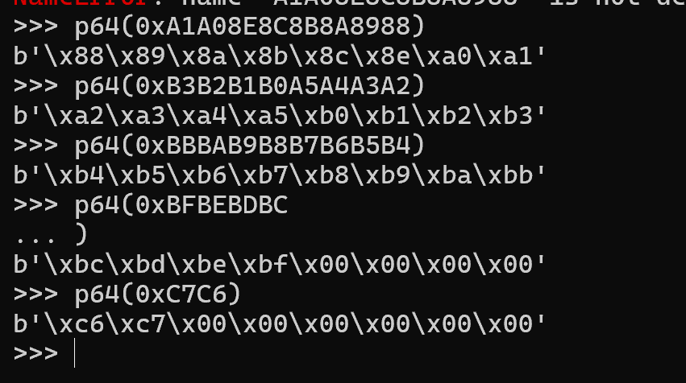
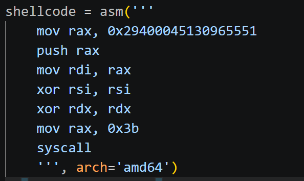
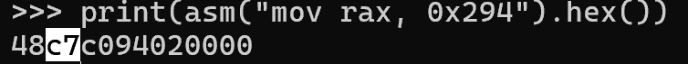
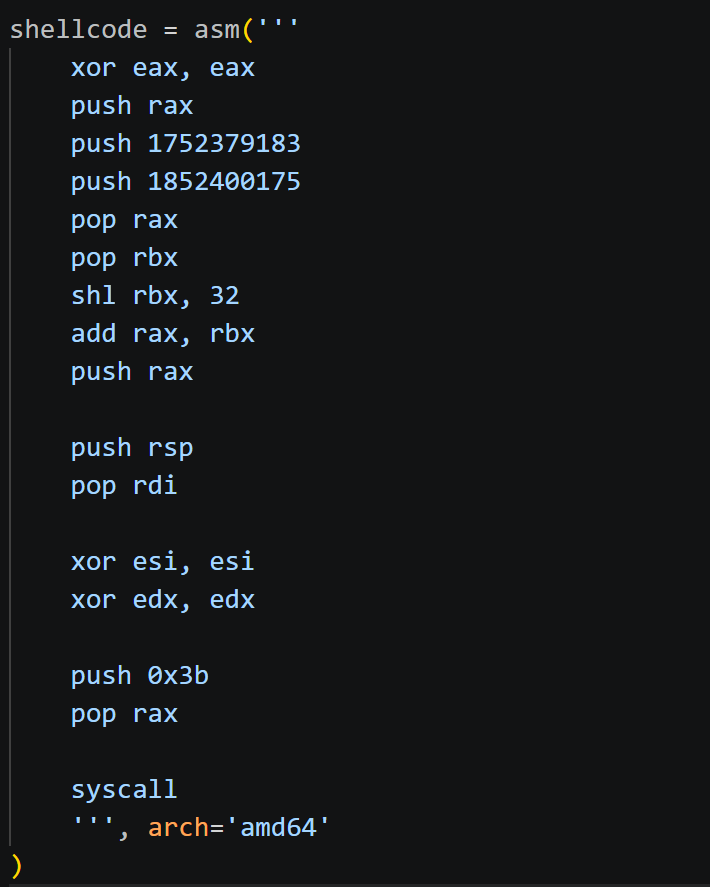
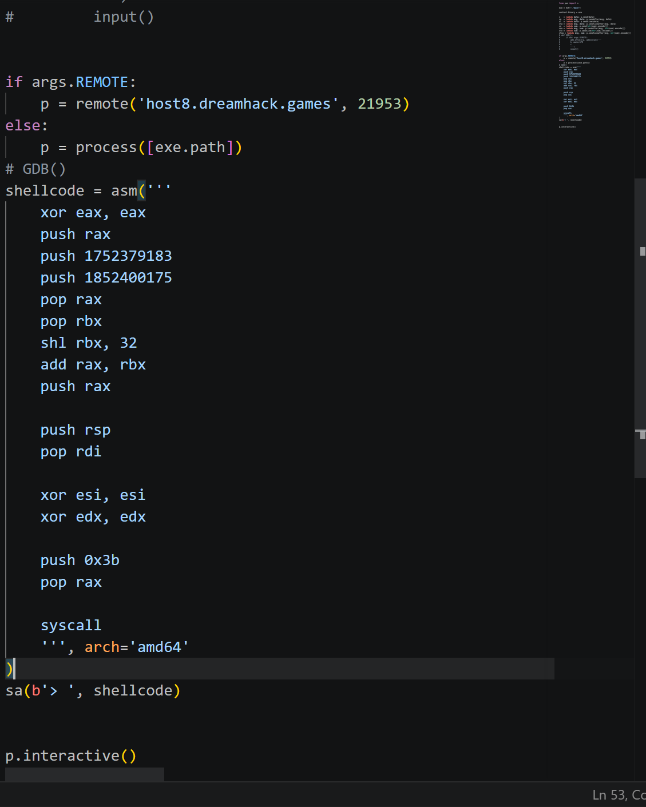
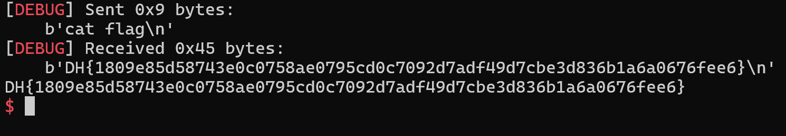

# 1. Find Bug :

- Viết shellcode

# 2. Idea :

- Vào verify là check các byte của shellcode, nếu trùng -> ko thực thi được ( Phải viết shellcode né các byte bị chặn )

# 3. Exploit :

- `p64()` lần lượt vào để xem những `byte bị chặn`

- Viết 1 đoạn shellcode basic -> chuyển lần lượt các lệnh thành raw bytes -> lệnh nào trùng `byte bị chặn` -> fix, ví dụ :

-------------------

- Như lệnh này gán 1 số cho 1 thanh ghi -> ko được do dính byte bị chặn `c7`

- Từ shellcode basic, check từng dòng lệnh -> fix lần lượt ta được shellcode hoàn chỉnh bypass `verify` :

- `LƯU Ý` : Nếu `push` thẳng 1 số thì chỉ được `4byte` nên phải push 2 lần `/bin//sh`

## SCRIPT :

# 4. Get Flag :

# 5. Learned :

- Cách chuyển code shellcode -> byte 
