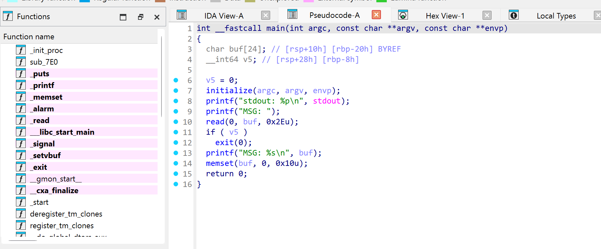
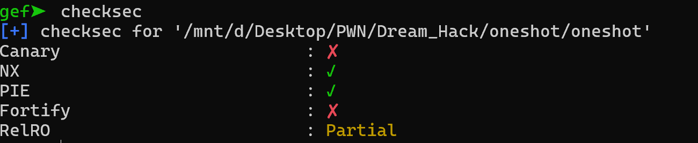
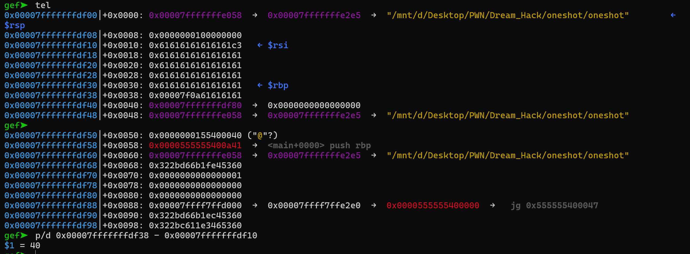
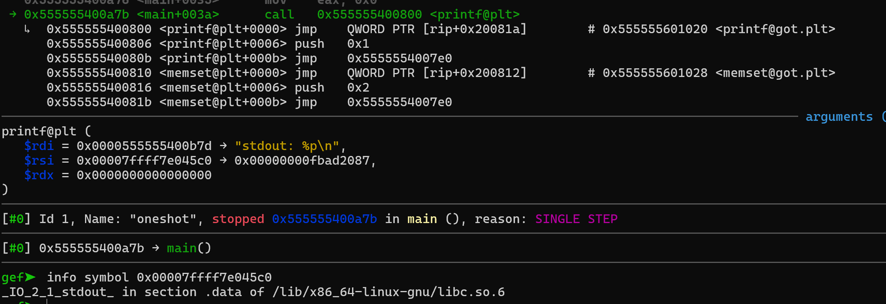
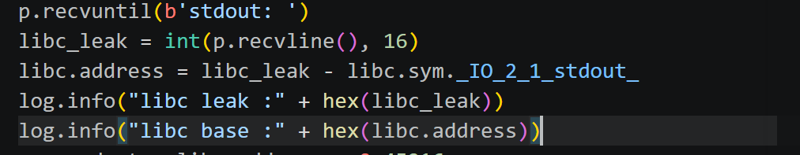
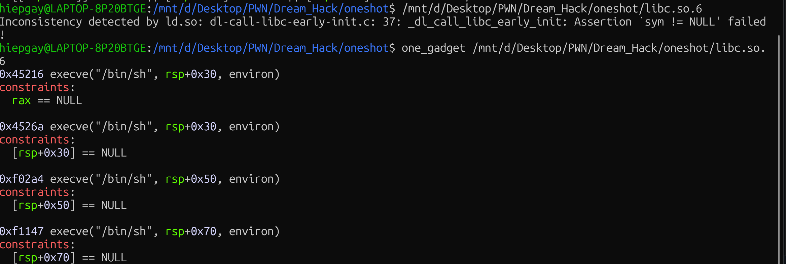
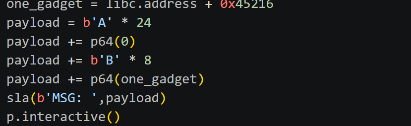
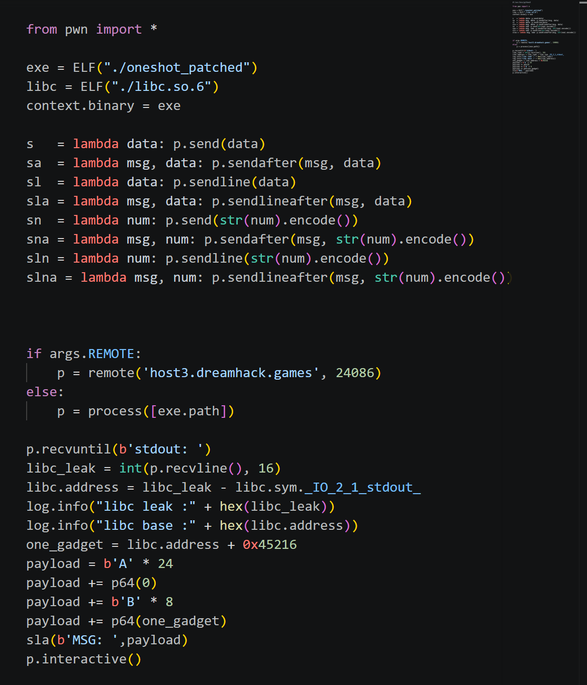
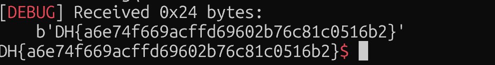

# 1. Find Bug :

- Buffer overflow ở `read`

- leak stdout không biết của hàm nào

# 2. Idea :

- Thấy NX bật -> r2shellcode ko được

- ROPChain thuần ko đủ thanh ghi

- Có thể dùng one_gadget hoặc ret2libc

- Nhận thấy offset = 40 nghĩa là chỉ overwrite được 6byte saved RIP -> one_gadget

# 3. Exploit :

- Vậy là đã biết địa chỉ được leak ra của hàm nào

- Viết script xác định libc base

- Dùng one_gadget -> offset và constraints

- Viết payload nhảy đến one_gadget, lưu ý có check giá trị bằng 0 tại [rbp-8]

### SCRIPT :

# 4. Get Flag :

