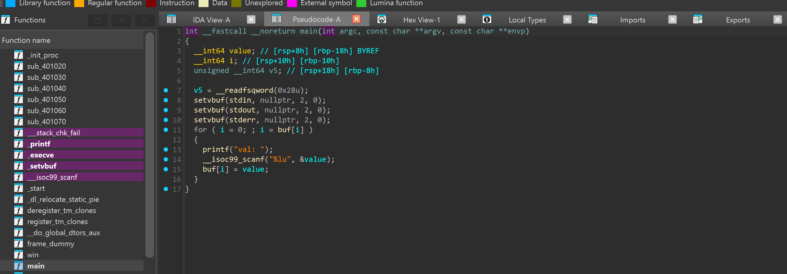
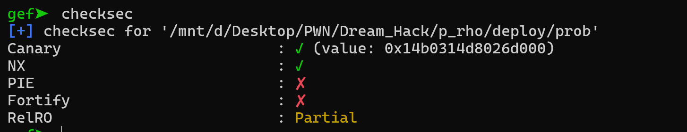
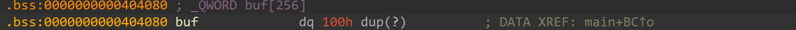
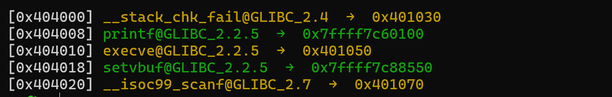
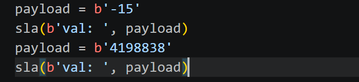
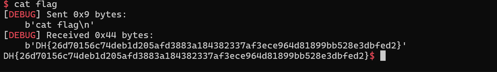

# 1. Find Bug :

- `i = buf[i]` <- `buf[i] = value` <- `value` do mình nhập mà `value` lại ở dạng int64 nên có thể nhập âm mặc dù `scanf` ở dạng `%lu` (có thể tự chuyển số âm nhập vào thành dạng unsigned)

-> Có thể truy cập `i` < 0 -> OUT OF BOUND

- Có hàm `win`

# 2. Idea :

- PIE tắt -> ko phải leak binary address

----------------

- Có thể thấy `buf` ở `0x404080` còn `GOTprintf` ở `0x404008` cách nhau `120` -> `buf[-15]` sẽ là `GOTprintf`  -> Overwrite GOT -> `win`

# 3. Exploit :

- `Payload 1` để set `i = -15`

- `Payload 2` để Overwrite `GOTprintf` -> win

# 4. Get Flag :

