# 1. Find Bug : 

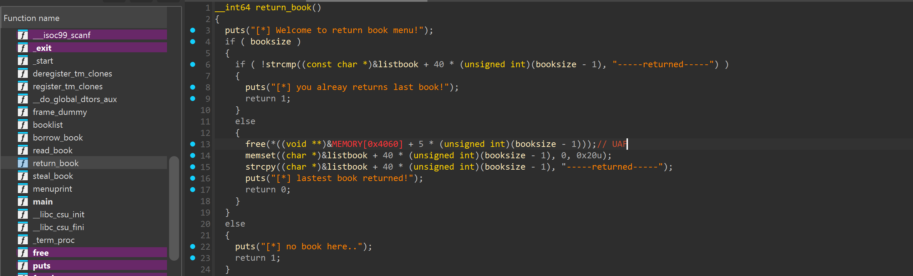

- Ở hàm `return book` có `free` nhưng ko cho con trỏ về NULL -> Use-After-Free

# 2. Idea : 

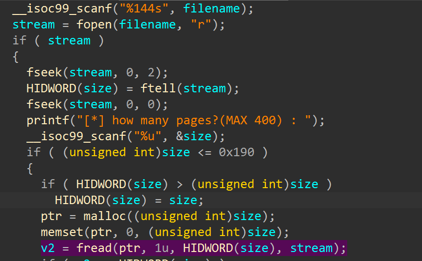

- Quan sát hàm `steal book` thấy `fread` sẽ đọc nội dung từ mở và đọc nội dung file (do mình nhập) và ghi vào vùng ptr được `malloc()` mà `malloc()` bao nhiêu mình cũng do mình nhập

-> Open file chứa flag `/home/pwnlibrary/flag.txt`(đề bài cho) và đọc vào vùng `ptr` -> `Printf` content `ptr`(Bằng cách tận dụng Use-after-free)

# 3. Exploit :

- Trước hết test local ta sẽ tạo file `flag.txt` để test

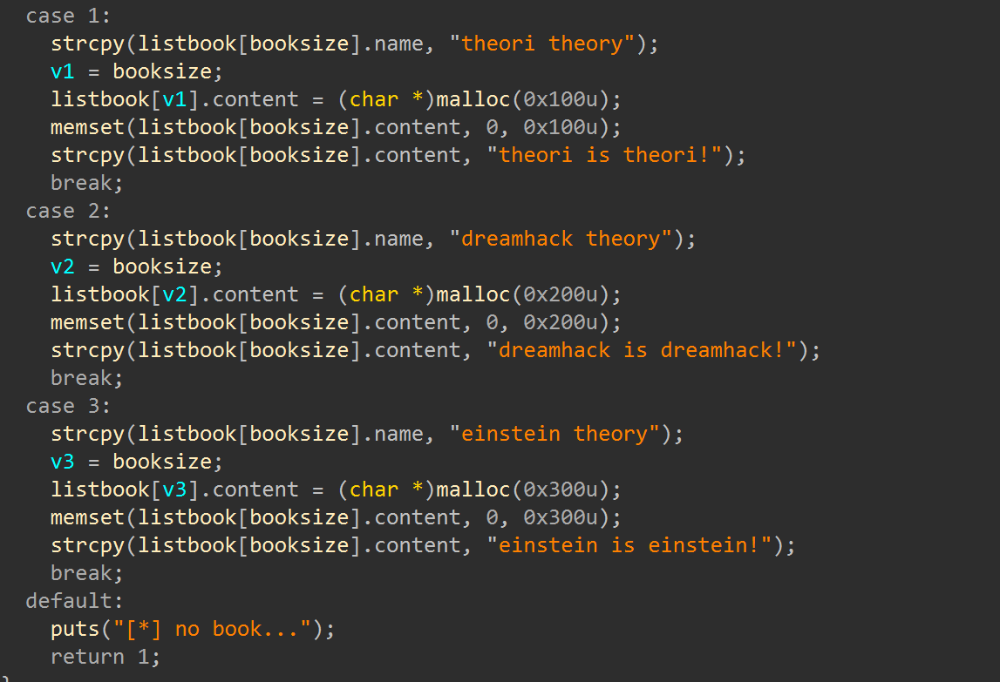

----------------------------------
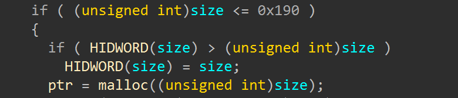

- Với việc hàm `borrow book` sẽ `malloc()` lần lượt 0x100, 0x200, 0x300 với từng case và `steal book` ptr `malloc(size)` (size <= 0x190) vậy thì ta sẽ chọn case 1 ở `borrow book` -> free -> `malloc(size)` = 0x100 ở `steal book` để tận dụng use-after-free rồi dùng hàm `read book` để đọc là sẽ ra flag

- Bắt đầu test :

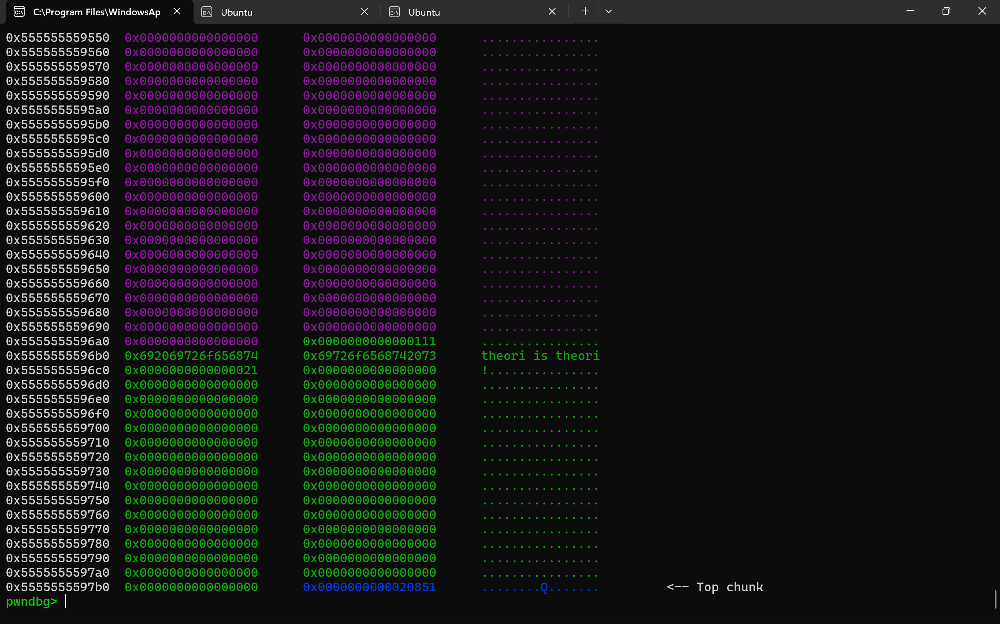

------------------------------------------------
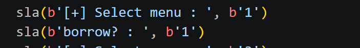

- Sau khi chọn `option 1 : borrow book` và chọn case 1 ta được 1 chunk xanh lá như hình

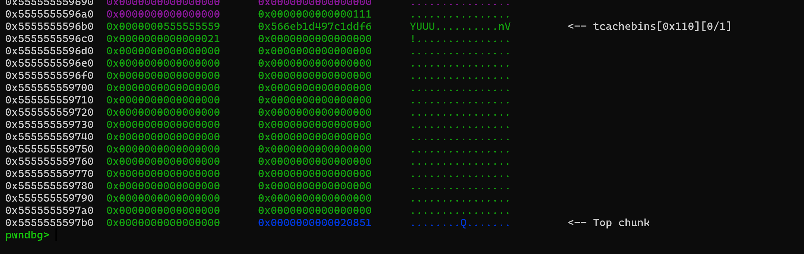

------------------------------------------------
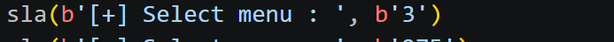

- Sau khi `free` đã vào `tcache bin`

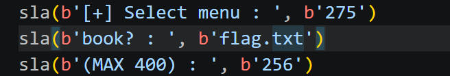

------------------------------------------------
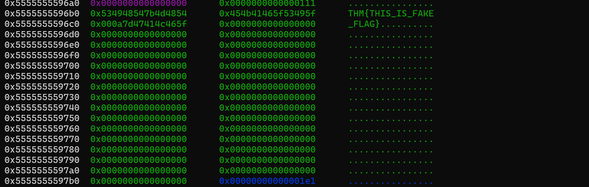

- Vào `stealbook` và nhập `size` = 256(0x100) rồi `malloc()`, quan sát khi xong hàm `stealbook` thấy chunk màu xanh lá đã được ghi flag từ `fread`

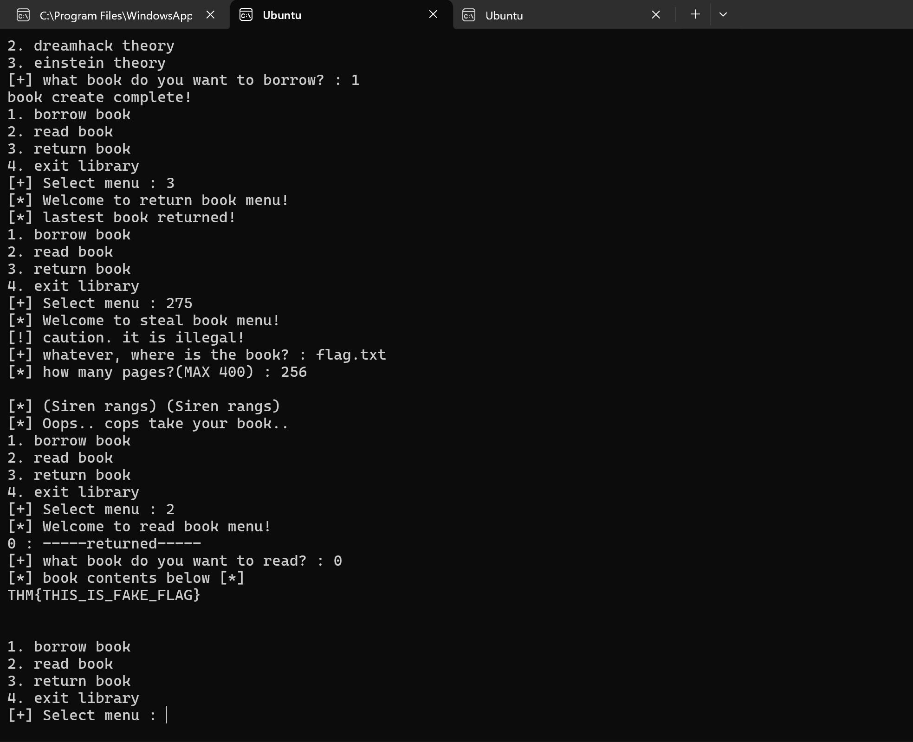

- Cuối cùng `read book` sẽ ra flag

- Giờ chỉ cần thay `flag.txt` thay đường dẫn đến flag thật là xong

## SCRIPT :

  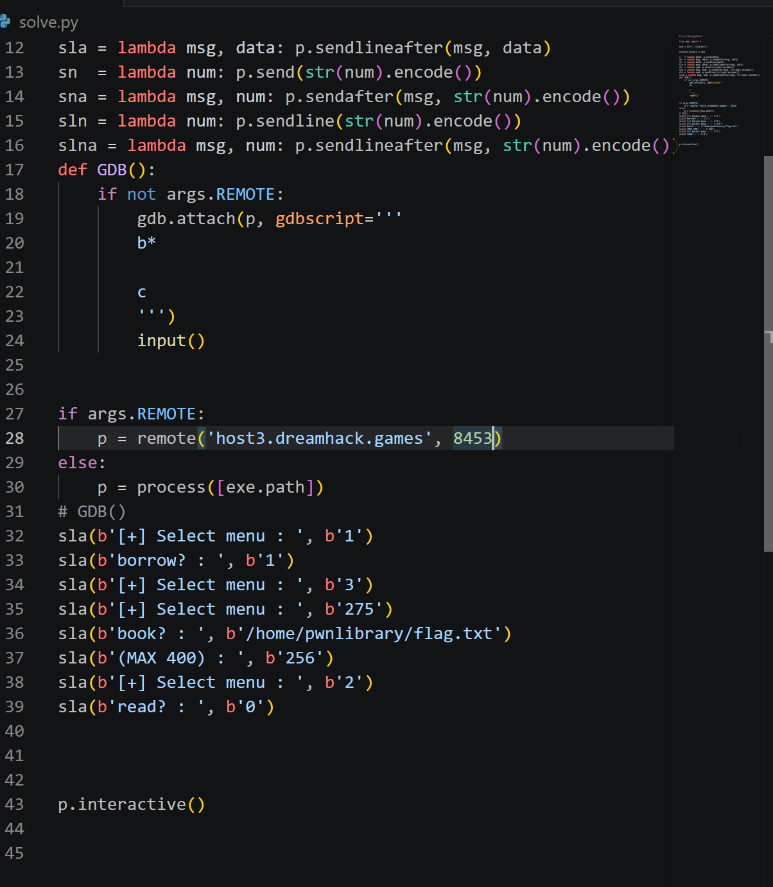

# 4. Get Flag :

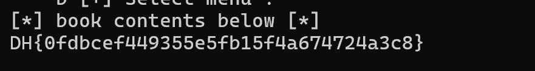

