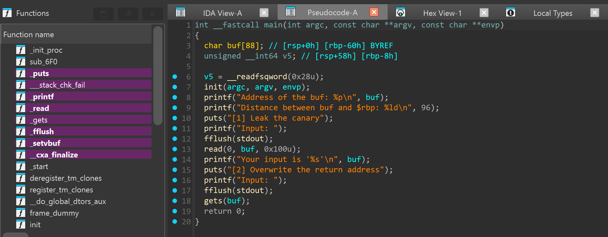
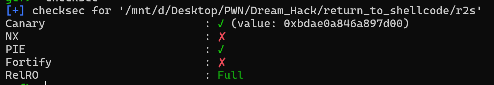
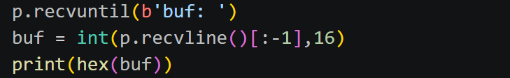
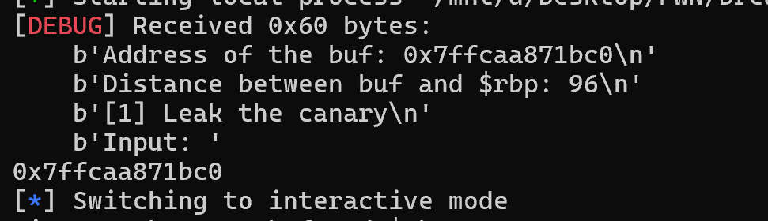
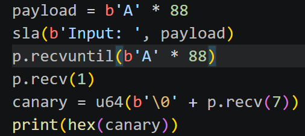
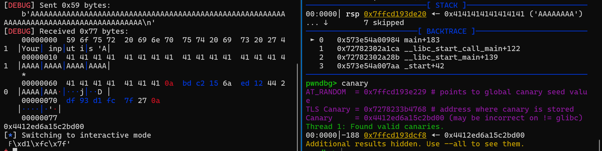
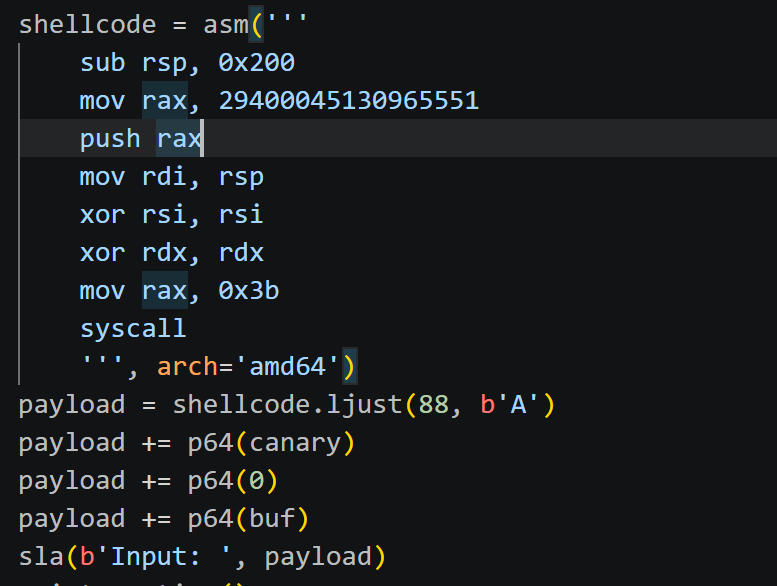
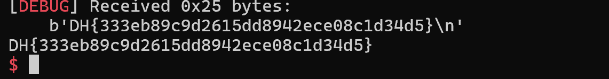

# 1. Find Bug :

- Leak address buf, distance buf & $rbp

- Buffer overflow ở hàm `read`, `gets`

# 2. Idea :

- NX off -> r2shellcode

- PIE bật -> cần leak, nhưng bài này cho sẵn địa chỉ buf 

- Stage 1 : Leak canary

- Stage 2 : Gửi shellcode và overwrite return address -> shellcode

# 3. Exploit :

----------------

## - Trước hết, lấy địa chỉ buf mà chương trình leak

-----------------

- Leak canary, đồng thời check bằng `gdb.attach` luôn

- LƯU Ý : Vì canary luôn có `NULL Byte` ở cuối nên dùng `sla` cho hàm `read` thay vì `sa` như thông thường để có `\n(0a)` nối chuỗi 7 byte còn lại của canary -> Sau khi nhận 88 byte 'A' cũng phải nhận thêm `1byte` để skip `0a` -> Để hoàn chỉnh canary phải nhận thêm `NULL byte` ở đầu khi u64

- Viết shellcode và overwrite return address -> shellcode

- LƯU Ý : Ở chỗ `sub rbp, 0x200`, vì một lí do nào đó nếu chạy ko có cái này `local` thì được nhưng lên `sever` lại ko được, có thể do `rsp % 16 phải == 0` nên phải thêm dòng này để `sever` được

- HOẶC có thêm 1 cách khác : dùng `shellcode = asm(shellcraft.sh())`, ko cần tự viết shellcode (chỉ dùng cho mấy shellcode đơn giản)

# 4. Get Flag : 

