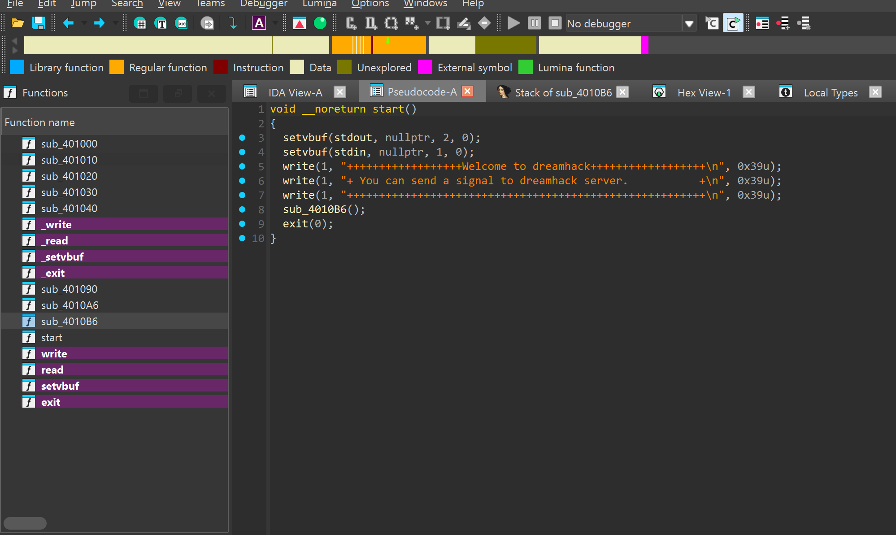
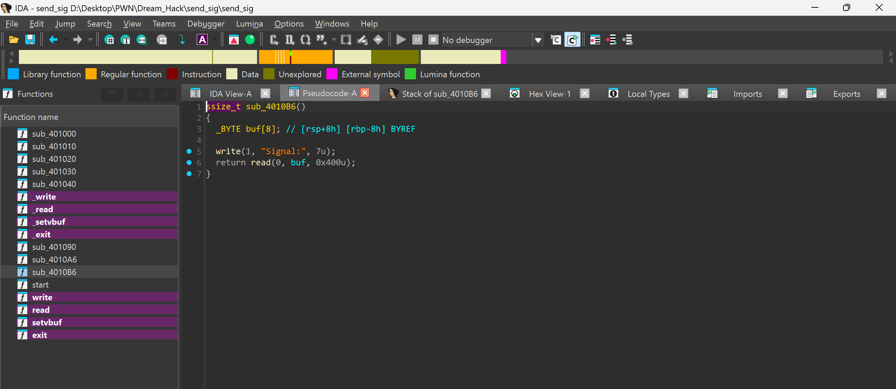
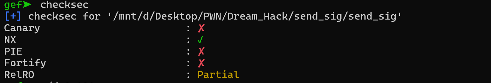
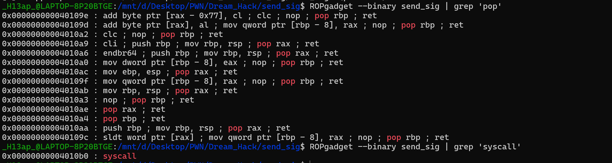
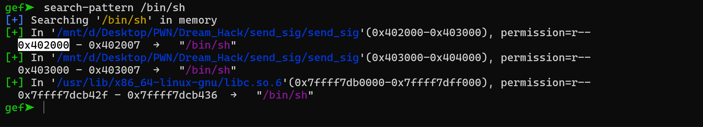
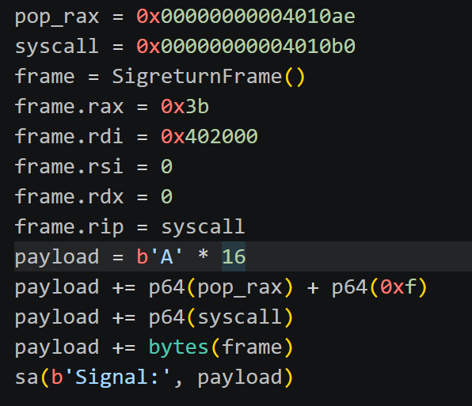
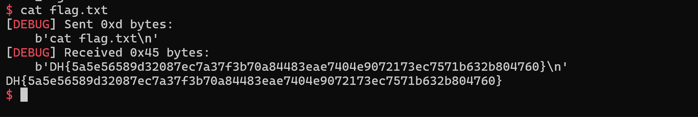

# 1. Find Bug :

----------------------

- File bị `stripped`

- Buffer overflow ở hàm `read`

# 2. Idea :

- Ko thể leak libc

- ko có hàm nào chạy `system`, `execve`

- Ko đủ gadget để ROPgadget thuần

- NX bật -> ko ret2shellcode

-> Mà tràn rất nhiều byte, có thể dùng SROP

# 3. Exploit :

- Offset từ `buf` đến saved RIP là `16`(8 byte cho `buf`, 8byte cho `saved RBP`)

- Lấy được 2gadget `pop rax` và `syscall`

- Có sẵn `/bin/sh`

## SCRIPT SROP chạy execve :

# 4. Get Flag :

