# 1. Find Bug :

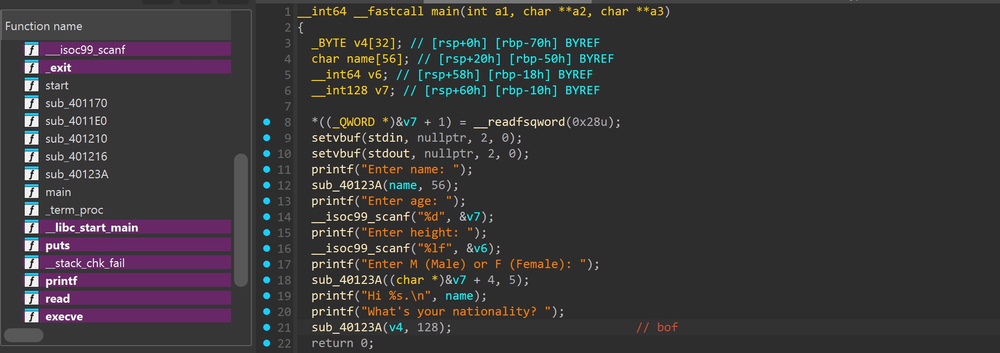

- Buffer overflow ở hàm `sub_40123A(nation, 128)` do trong đó có hàm `read` với 2 tham số truyền vào :

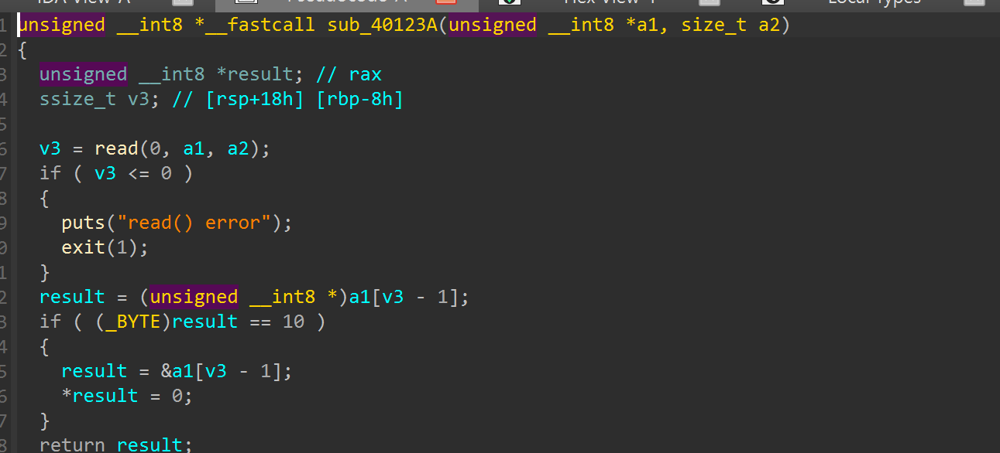

- Và ở bên trái ta thấy có hàm `sub_401216` chạy `execve`

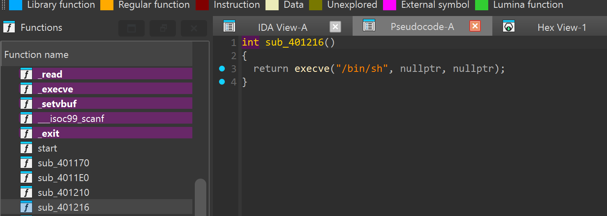

# 2. Idea :

- Tìm cách leak & bypass `canary`

- Overwrite saved RIP -> `sub_401216`

# 3. Exploit :

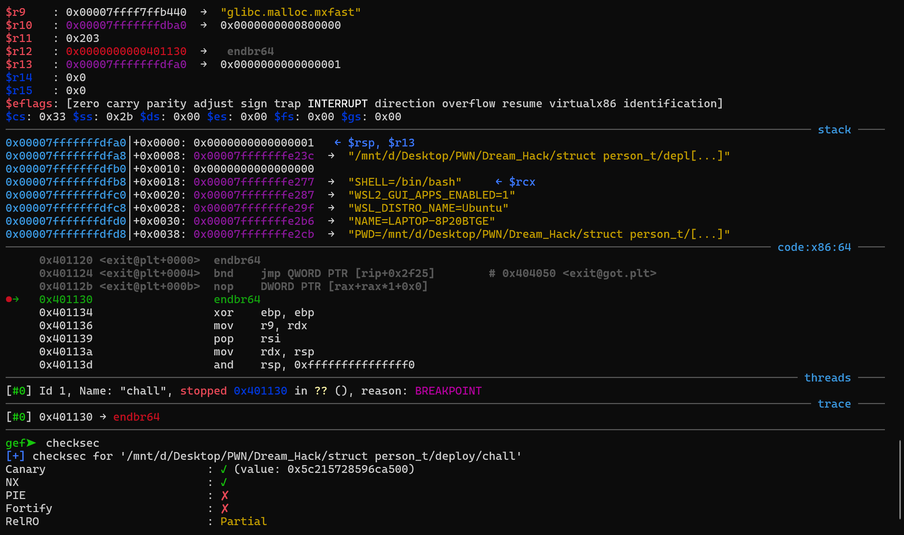

- Trước hết ta thấy file bị stripped

- PIE tắt -> Có thể hardcore thẳng địa chỉ hàm `sub_401216`

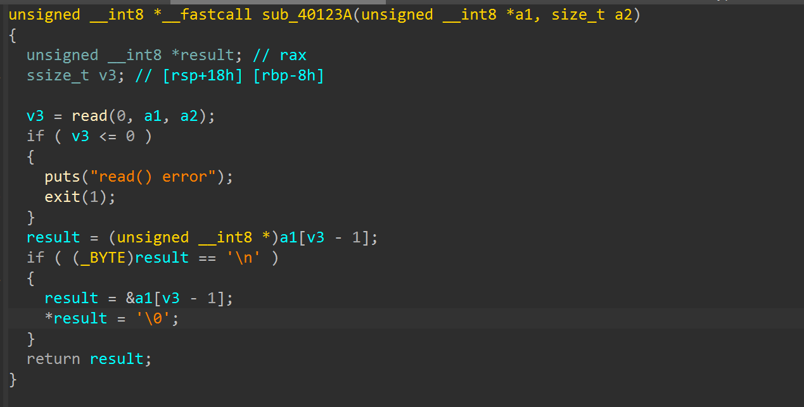

- Ở hàm `sub_40123A` : Nếu kí tự cuối là `\n` -> `\0` -> Nếu ta nhập full size sẽ ko dính `\0`

-> Để leak canary ta nhập full size `name`, nhập số thật lớn cho `age` và `height` để ko dính NULL byte, và quan trọng nhất là 5 byte ở `&age + 4` để nối thẳng tới `canary` 

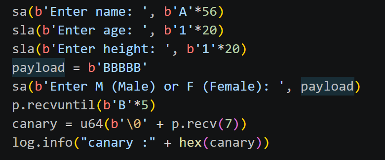

-------------------------------

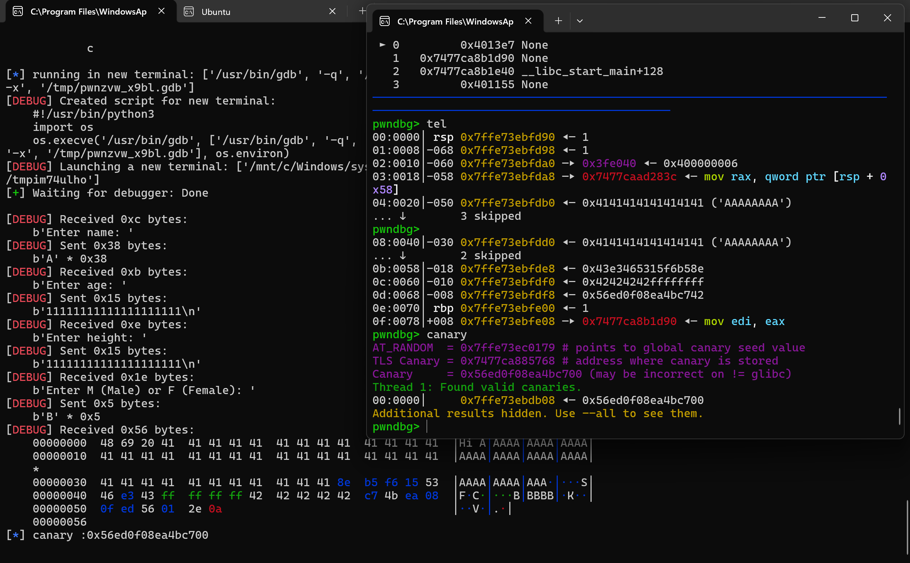

- Sau `DEBUG` ta thấy canary đã chuẩn giờ tiếp theo là overwrite saved RIP -> `sub_401216`

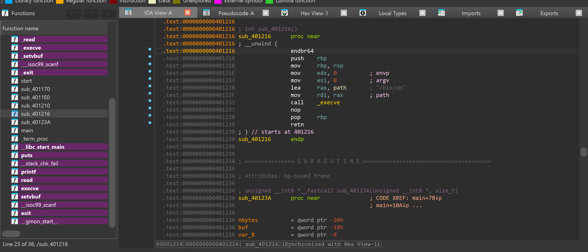

- Vào `ida` ta có thể thấy nó ở địa chỉ `0x0000000000401216`

- `canary` có, `địa chỉ cần overwrite` có -> tính offset từ `nation` đến `saved RIP` là xong

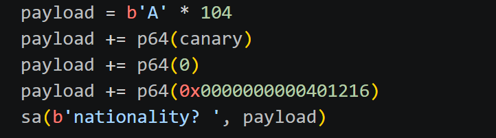

## SCRIPT :

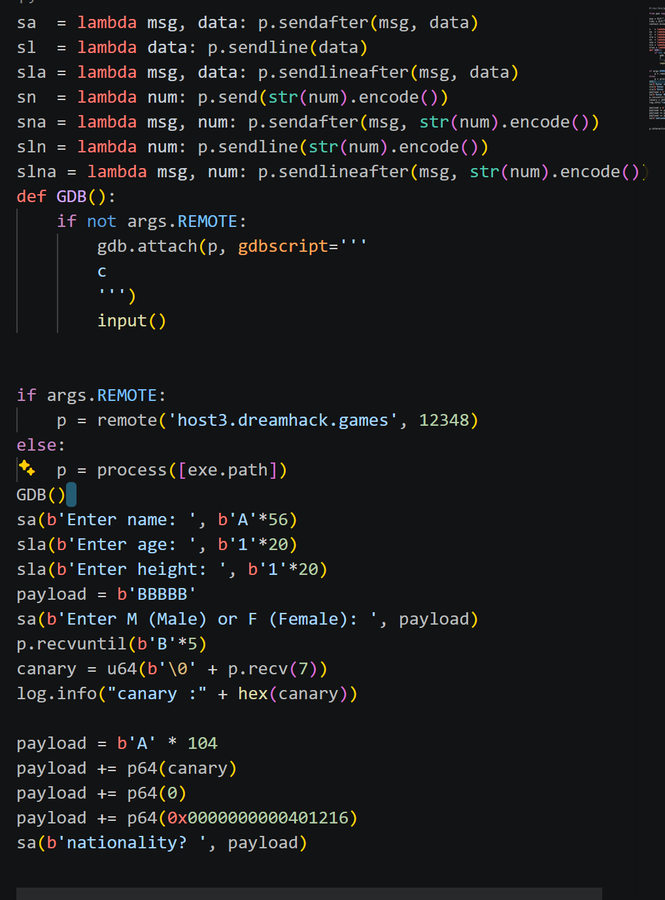

# 4. Get Flag :

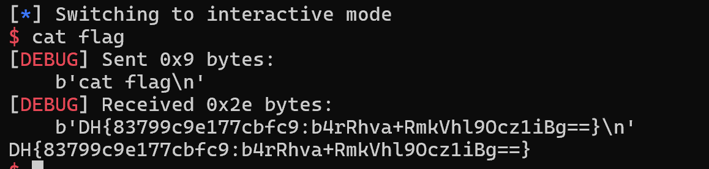

