# 1. Find Bug :

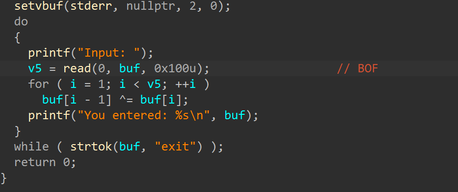

- BOF ở hàm `read`

# 2. Idea :

- Tận dụng `BOF` ta có thể Overwrite saved RIP -> `target address` nhưng vì có XOR nên ta cần decode 

- Lại có thêm hàm `printf` in ra nên có thể leak libc,...

- Và chắc chắn phải bypass `strtok` để thoát vòng lặp, nếu ko Overwrite saved RIP vô nghĩa

# 3. Exploit :

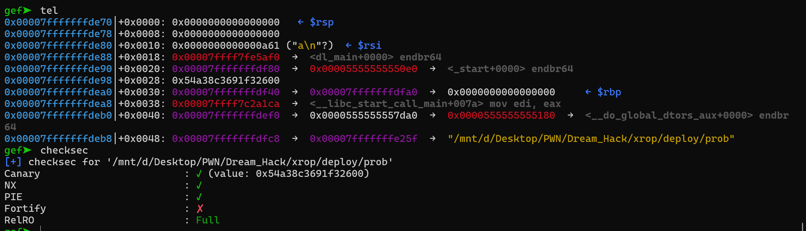

- Có thể thấy checksec gần như bật full -> Trước hết cần leak canary

- Quan sát trên stack thấy `libc_start_call_main` -> leak được libc

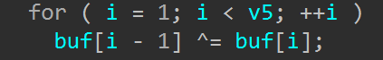

- Theo logic của XOR X[i] = X[i] ^ X[i+1] và byte cuối sẽ giữ nguyên, nên padding 2 byte liên tiếp ko được `giống nhau` nếu ko XOR sẽ tạo ra NULL byte sớm và `printf` sẽ kết thúc trước khi leak được libc, canary

- Tìm offset canary, libc rồi leak :

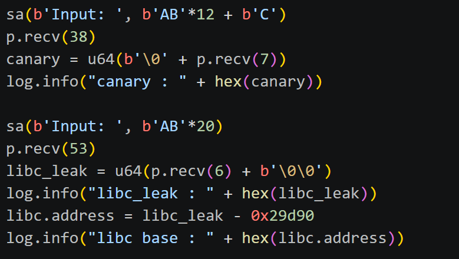

------------------------------------
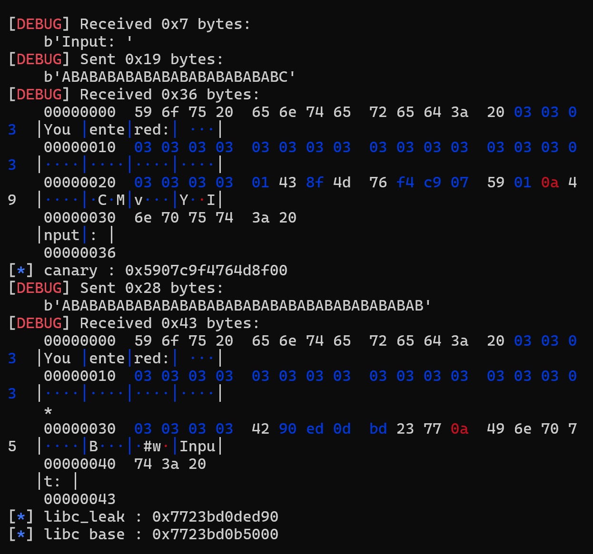

- Vì bài ko cho sẵn libc nên ta cần tải libc từ `Dockerfile` rồi load vào script

- Hàm decode để payload cuối sau khi XOR đúng như mình muốn :

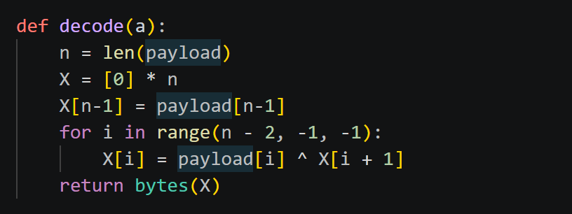

- Để bypass `strtok` và overwrite saved RIP ta cần gửi 24 byte đầu là `\0`(encode) vì khi `strtok` kiểm tra thấy sau khi XOR thấy NULL byte sẽ dừng và trà về NULL luôn -> bypass, tiếp đến là canary(encode) và saved RBP()

- Đến đây ta có 2 hướng là `one_gadget` hoặc gọi `system(/bin/sh)` từ libc :
  
  + Theo hướng 1 sau khi thử hết các offset của `one_gadget` nhận thấy vì `RBP` luôn là 1 mà `constrant` thì cần `[RBP - x]` ra địa chỉ tồn tại và có thể viết nên khá khó thỏa mãn -> qua hướng 2 

  + Theo hướng 2 cần gadget `pop_rdi` và tìm `/bin/sh` có sẵn chưa

  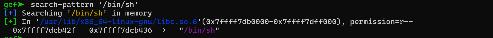

  -------------------------------------------------
  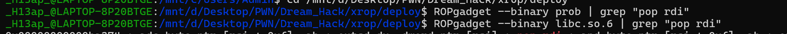

    `/bin/sh` đã có sẵn nhưng gadget `pop_rdi` tìm ở binary ko có, qua libc tìm và đã thấy 

    

    Nhưng lại có vấn đề : 
    
    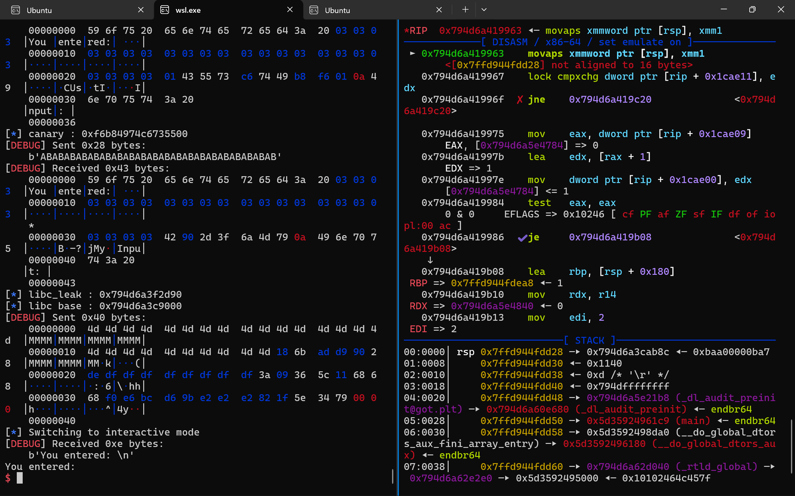

    Lại dính `ko chia hết 16` nên ta phải kiếm thêm gadget `ret` và nhét vào payload

    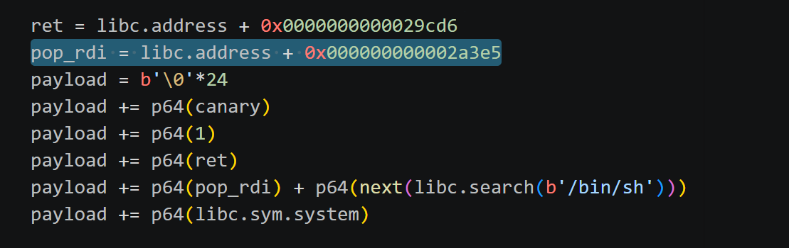
    

# 4. Get Flag :

  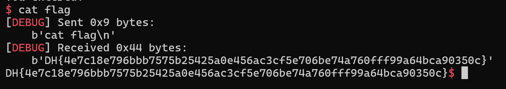

# 5. Learned :

- Cách tìm gadget ngoài binary còn libc 

- Cách viết decode theo logic
